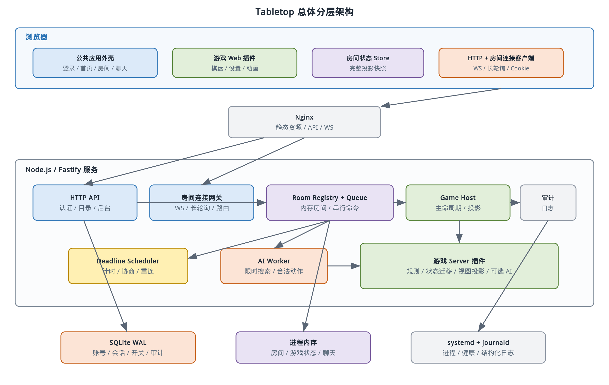
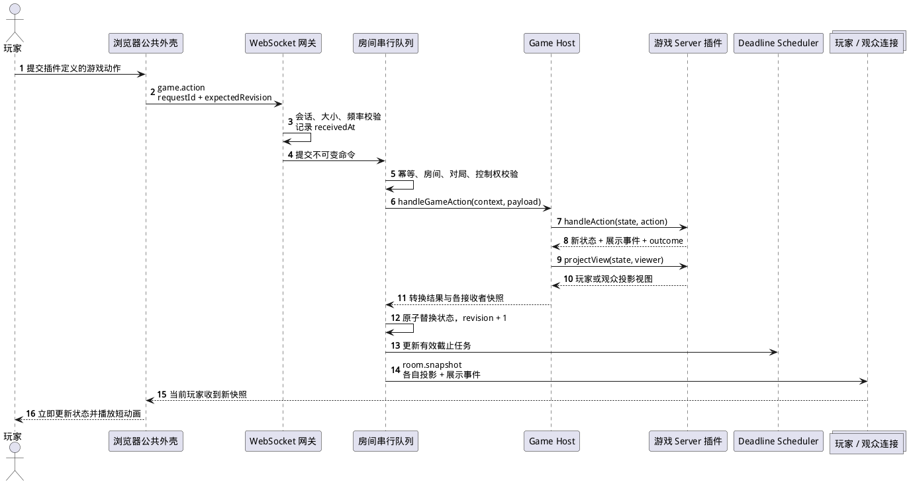
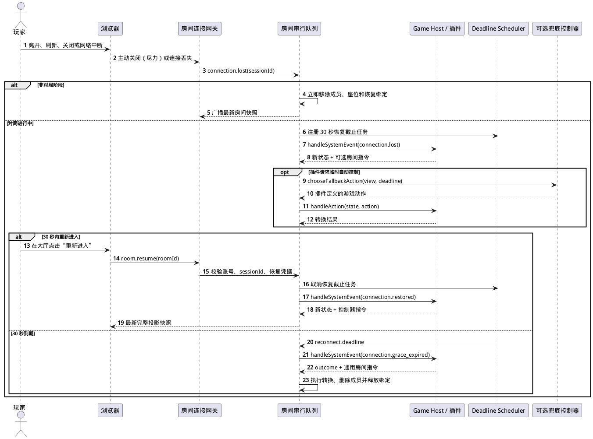

# Tabletop 总体架构设计

> 状态：实现基线（与 `develop` 当前实现同步）
> 版本：0.4
> 更新日期：2026-07-20

## 1. 设计背景

Tabletop 是一个单站点、多游戏、少量熟人实时联机的平台。公共基础设施必须允许核心开发者持续添加规则、操作模式和界面差异很大的游戏，同时保持平台核心与具体游戏规则隔离。

系统的主要矛盾不是吞吐量，而是规则正确性和扩展边界：平台既不能把所有游戏压成同一种棋盘操作，也不能让每个游戏重复实现登录、房间、连接、断线和权限。架构因此采用“稳定平台核心 + 版本化游戏 SDK + 编译期游戏插件”。

## 2. 架构目标与约束

### 2.1 目标

- 一个网页入口完成登录、游戏导航、房间和对局，不安装独立客户端。
- 服务端唯一权威执行规则，支持隐藏信息和未来防作弊要求。
- 游戏可以自定义状态、动作、设置、界面、计时和 AI。
- 公共房间层不引用任何具体游戏的状态、动作或结果类型。
- 单台资源受限的服务器即可开发和运行。
- 插件 API 在同一主版本中向后兼容，并为同时行动、实时 tick 留出空间。

### 2.2 约束

- 游戏插件只由核心开发者维护，随源码构建；不支持热安装或不可信脚本。
- 房间和对局只保存在单进程内存中，服务器重启允许丢失。
- SQLite 只保存低频平台数据，不保存对局、聊天和战绩。
- 首期只有一个服务实例，不引入 Redis、消息队列或分布式锁。
- 部署不使用 Docker，正式进程由 systemd 以低权限用户管理。

## 3. 技术选型

| 层次 | 选择 | 原因 |
| --- | --- | --- |
| 语言 | TypeScript | 浏览器、服务端和游戏共享类型；适合单人长期维护 |
| Web | React + Vite + React Router | 组件化游戏界面、快速构建和直接路由 |
| 客户端状态 | TanStack Query + 轻量房间 store | HTTP 缓存与实时房间状态职责分离 |
| HTTP 服务 | Node.js LTS + Fastify | 低开销、内置结构化日志、插件边界清晰 |
| 实时传输 | 原生 WebSocket 优先，同源 HTTP 长轮询后备 | 保持低延迟，并兼容禁用或拦截 WebSocket 的浏览器与网络 |
| 数据校验 | Zod | 设置、HTTP、房间消息和插件边界共享运行时校验 |
| 数据库 | SQLite WAL + Drizzle | 数据量小、备份简单、迁移可版本化 |
| 密码 | Argon2id | 现代密码哈希，支持可调内存与时间成本 |
| 测试 | Vitest + Playwright | 规则单测、服务集成测试和浏览器流程覆盖 |
| 反向代理 | Nginx | 静态资源、HTTP API、长轮询与 WebSocket 统一入口 |

选择 TypeScript 并不牺牲当前场景的实际性能。普通动作只涉及小型内存状态和少量广播；计算密集型插件任务放入 Worker Thread，并由插件声明硬时间预算。相比跨语言 RPC，单语言共享协议类型更能降低边界偏差和维护成本。

## 4. 总体结构

下图展示浏览器、平台服务、游戏插件和持久化之间的边界。蓝色区域是公共平台，绿色区域由每个游戏分别实现，橙色区域是持久化和系统设施。



框架中的关键关系如下：

1. 浏览器公共外壳负责认证、导航、房间大厅、玩家列表和聊天，并按 `gameId` 加载对应游戏界面模块。
2. 房间连接网关统一承载 WebSocket 与 HTTP 长轮询，只解析通用信封、认证会话和路由房间命令，不理解具体游戏动作载荷。
3. 房间运行时串行处理命令，调用游戏服务端插件验证和迁移状态。
4. 游戏插件为每个玩家和观众生成投影视图，隐藏信息永不发送给无权浏览器。
5. SQLite 与房间状态严格分离；数据库故障不会产生半持久化对局，进程重启则明确终止全部房间。

## 5. Monorepo 与模块边界

当前 monorepo 目录如下。目录是实现合同的一部分，具体文件可在不破坏职责的前提下调整。

```text
tabletop/
├── apps/
│   ├── web/                 # React 网站与浏览器游戏注册表
│   └── server/              # Fastify、房间连接、房间运行时和后台
├── packages/
│   ├── protocol/            # HTTP/房间信封、错误码和共享 DTO
│   ├── game-sdk/            # Game SDK v1 类型、校验器和测试工具
│   ├── database/            # SQLite schema、迁移和 repository
│   └── ui/                  # 公共布局与基础控件
├── games/
│   ├── template/            # 不注册上线的可复制插件模板
│   └── <game-id>/           # 每个游戏的 shared/server/web/tests
├── scripts/                 # 初始化、构建、部署、备份和维护脚本
├── deploy/                  # Nginx 与 systemd 配置
└── docs/                    # 需求、架构、协议、游戏和部署文档
```

`apps/server` 可以依赖游戏的 `shared` 和 `server` 入口，不能依赖 React 界面；`apps/web` 可以依赖 `shared` 和 `web` 入口，不能打包服务端规则或 AI。游戏之间不得直接依赖，只能依赖公共 SDK。

具体游戏只允许在两个组合根中注册：`apps/server/src/games/registry.ts` 和 `apps/web/src/games/registry.ts`。`scripts/check-game-boundaries.mjs` 扫描 `apps/*/src` 与 `packages`，禁止其他生产代码导入具体游戏包或出现具体游戏 ID 字面量；根命令 `pnpm check:architecture` 执行该守卫。`games/template` 是可复制的完整最小插件，但不会进入任一注册表。

## 6. 服务端组件

### 6.1 HTTP API

HTTP 层处理登录、会话、游戏目录、房间列表与创建、账号后台、服务开关和审计导出。所有输入先经过 Zod 校验，再进入应用服务。HTTP 只返回稳定 DTO，不直接序列化数据库行。

已实现路由分别位于 `apps/server/src/auth/routes.ts`、`apps/server/src/admin/routes.ts` 和 `apps/server/src/rooms/routes.ts`，共享 DTO 与 Zod schema 位于 `packages/protocol/src/http`。公开业务 API 使用 `/api/v1` 前缀。

### 6.2 房间连接网关

`apps/server/src/rooms/gateway.ts` 为 WebSocket 和 HTTP 长轮询分配统一的 `connectionId`，并把连接绑定到服务端解析的 `accountId` 与登录 `sessionId`。每条连接最多再绑定一个房间，但同一 `sessionId` 可以为多个不同房间分别建立连接。WebSocket 在升级握手时验证 Origin 和会话；长轮询的创建、poll、命令与关闭接口验证会话、同源 Origin 和 CSRF。网关负责：

- 解析协议版本和通用消息信封。
- 校验单条大小、频率、`requestId` 和当前房间绑定。
- 把房间命令提交给对应 `RoomSerialQueue`。
- 按投影视图向玩家、观众或单个连接发送快照和事件。
- WebSocket 控制帧与应用层心跳、长轮询请求超时/租约与队列背压、断线通知和 30 秒重连关联。

两种传输共享命令限流、`requestId` 去重、房间绑定、命令分发和快照投影。网关不执行游戏规则，也不根据客户端声称的座位决定权限。座位控制权始终从房间成员状态查询。

### 6.3 房间目录与运行时

`apps/server/src/rooms/registry.ts` 中的 `RoomRegistry` 是进程内房间索引，按 `roomId` 保存 `apps/server/src/rooms/room-runtime.ts` 中的 `RoomRuntime`，并按 `sessionId + roomId` 保存可恢复的成员绑定。每个运行时包含大厅状态、成员、控制连接、最多 100 条的聊天 FIFO 队列、游戏设置、游戏实例、修订号和截止任务。

每个房间拥有逻辑串行命令队列。成员命令、游戏动作、连接变化、截止任务和 AI 返回结果都进入该队列，同一时刻只允许一个此类命令改变房间状态。全站/单游戏关闭和进程停止调用幂等 `destroy()`，属于直接终止房间的例外，不再执行规则转换。Node.js 单线程并不能自动避免异步交错，因此除终止例外外的房间可变状态入口都必须串行化。

### 6.4 游戏宿主

`packages/game-sdk/src/server/registry.ts` 中的宿主适配器从编译期注册表按 `gameId` 取得 `GameServerModuleV1`，负责：

- 使用插件设置 schema 校验房主配置。
- 创建游戏初始状态并注入随机数、时钟和日志上下文。
- 把通用动作信封中的 `payload` 交给插件校验和迁移。
- 保存返回的新状态、展示事件、截止任务和结束结果。
- 调用插件的 `projectView` 为每个接收者生成独立快照。
- 在需要时调用可配置 AI 或断线/超时兜底控制器，并把结果重新提交为普通游戏动作。

插件不能直接访问 WebSocket、长轮询、SQLite、文件系统或全局房间表。必要能力通过窄上下文注入，保证规则可测试且未来可以迁移到其他运行方式。

### 6.5 截止任务调度

当前没有独立的 `DeadlineScheduler` 服务。`RoomRuntime` 为插件 `getDeadlines()` 返回的任务和 30 秒重连窗口分别维护进程内定时器；定时器只负责把闭包重新提交到该房间串行队列。

游戏截止任务捕获 `matchId` 与 `revision`，执行时重新比较活动对局、修订号和房间状态；重连截止任务比较成员状态与原 `reconnectUntil`。这样即使系统暂停、定时器晚触发或原任务已被动作取消，也不会错误执行旧任务。

### 6.6 AI 与兜底控制器执行

生产默认通过 `apps/server/src/automation/executor.ts` 中的 `SingleWorkerAutomationExecutor` 串行执行 AI 和兜底动作，Worker 入口为 `apps/server/src/automation/worker.ts`。`GAME_AI_WORKERS` 当前只接受 `0` 或 `1`，默认 `1`；`0` 使用进程内执行器，主要供测试和受控调试使用。首期只启用一个计算型 Worker，避免并行搜索抢占事件循环和系统内存。

Worker 请求包含插件生成并经 schema 校验的不可变自动化输入、座位、修订号、决策种子和硬截止时间，不包含房间可变对象。执行器使用单任务队列、硬超时和一次 Worker 故障重试；房间以 `matchId + seatId` 去重任务，返回动作时再次校验对局状态对象、当前行动座位和控制器，聊天或房间名等非游戏修订不会使合法结果过期。房间销毁后不回写或继续调度；执行器失败时从 250 ms 开始指数退避，同一状态连续失败 5 次则以内部错误关闭房间，避免热循环和静默僵局。可配置 AI profile 与断线/超时兜底控制器使用同一普通动作入口，但只有前者通过游戏目录的 `botProfiles` 公开给房主选择。

## 7. 浏览器组件

### 7.1 公共应用外壳

公共外壳位于 `apps/web/src`，提供登录、首页、游戏目录、房间列表、创建房间、房间成员、准备、房主操作、观众列表、聊天、连接提示和管理后台。HTTP 访问集中在 `apps/web/src/api/client.ts`，房间连接集中在 `apps/web/src/rooms/use-room-socket.ts`；后者优先建立 WebSocket，以应用层心跳识别半开连接，按带随机抖动的递增间隔重试，并在 WebSocket 与 `apps/web/src/rooms/long-polling-transport.ts` 之间交替恢复。公共层不知道游戏棋盘内部状态，只保存协议定义的通用 `RoomSnapshotPayload`。

### 7.2 游戏界面模块

`apps/web/src/games/registry.ts` 把 `gameId` 映射到 `GameWebModuleV1`。模块提供可选游戏设置编辑器、必需的游戏视图组件和可选规则错误格式化器。它运行在同一个网站 bundle 中，不是独立部署应用。

浏览器可做输入预检以改善体验，但服务端拒绝仍是最终结果。客户端不能通过共享包导入完整权威状态类型，尤其不能获得未来游戏的隐藏字段。

### 7.3 快照优先同步

首期游戏状态很小。状态发生变化时，服务端向房间内每个在线接收者发送完整投影快照，并附带本次展示事件；每个成功命令还向发起连接发送 `command.ack`，其 `stateChanged` 明确说明该命令是否改变状态。此方案比客户端补丁合并更简单，能可靠恢复刷新、丢包和动画积压。

客户端只有在快照 `revision` 大于当前版本时才替换状态。展示事件可以按序播放，但新快照立即成为交互依据；动画不得阻止状态前进。

## 8. 权威动作链路

下图描述一个插件定义的游戏动作从浏览器到所有参与者的完整过程。



动作收益来自三个边界：网关只处理通用协议，房间队列保证原子顺序，插件只负责规则。成功后不是广播同一内部状态，而是针对每个接收者重新投影，因此未来隐藏手牌无需推翻联机架构。

## 9. 连接、设备与座位控制

### 9.1 身份层级

系统区分四个标识：

| 标识 | 生命周期 | 用途 |
| --- | --- | --- |
| `accountId` | 账号存在期间 | 用户身份和座位归属 |
| `sessionId` | 单次设备登录会话，最长 30 天 | 区分多设备并支持撤销 |
| `connectionId` | 一条 WebSocket 或长轮询连接生命周期 | 路由消息、心跳或租约 |
| `roomId` / `matchId` | 房间/单局生命周期 | 防止旧动作进入新局 |

同一 `sessionId` 可以通过不同 `connectionId` 同时绑定多个不同房间，每条连接仍最多绑定一个房间；恢复索引使用 `sessionId + roomId`，不会用一个房间的连接覆盖同一会话在其他房间的绑定。同一账号可以在同一房间拥有多个观战成员身份，但最多占据一个真人座位。

### 9.2 断线、临时控制器与重连

非对局阶段网络断开或页面离开时，房间队列立即移除成员和座位、释放 `sessionId + roomId` 绑定并广播新快照，不创建恢复窗口。房间页面通过 `pagehide` 的 keepalive 关闭请求和 SPA 卸载时的传输关闭主动通知服务端，心跳与长轮询租约负责无法主动通知的异常情况。

对局阶段网络断开、手动离开或页面关闭时，房间队列先把连接标记为不可用，并统一向游戏宿主提交 `connection.lost` 系统事件。插件可以请求启用兜底控制器，也可以保持座位等待；游戏计时、自动动作和其他状态变化均由插件转换结果决定。平台同时创建完整的 30 秒重连截止任务，把原 `sessionId + roomId` 作为恢复凭据；处于 `reconnecting` 的成员在窗口内仍视为具有恢复资格。房间 HTTP 列表按当前会话投影 `resumeAvailable`，大厅使用“重新进入”直接建立恢复连接。

原设备在窗口内连接时，平台取消截止任务，向插件提交 `connection.restored`，并向浏览器发送最新完整投影快照。若浏览器已确认旧链路失效、服务端网络栈却仍把它视为在线，同一 `sessionId + roomId` 的新连接会直接替换旧 `connectionId`；旧连接随后到达的关闭事件因 ID 不匹配而被忽略。插件已经接受的自动动作不会因网络恢复而回滚。下图展示可选临时接管、快照恢复和窗口到期三条通用路径。



窗口到期时，平台把成员标记为 `offline` 并向插件提交 `connection.grace_expired`。插件可以返回结束比赛、继续自动控制或释放座位等通用指令；房间核心随后删除成员、释放对应的 `sessionId + roomId` 绑定并清除取回权限，不根据 `gameId` 推断比赛结果。同一会话在其他房间的绑定和连接不受影响；退出成员是房主时转给最早加入的剩余真人成员。

窗口到期后的通用成员规则如下：

- 无论是否关联座位，到期成员都从房间成员表清除，原会话之后普通加入会创建新的观战成员。
- 插件可以让退出座位继续由自动控制器完成当前对局，但座位不再可恢复或手动取回；对局结束时清除没有成员归属的遗留真人座位。
- 任一重连窗口到期后，平台重新检查房间成员；除空座单人练习房特例外，只要仍有 `connected` 或 `reconnecting` 成员就保留房间，否则立即销毁。多个同时掉线成员分别享有自己的完整 30 秒窗口。
- 声明 `soloPractice` 能力的练习房在全部座位变空时立即销毁，即使仍有观众连接；断线玩家的座位在窗口到期前仍保留，因此该特例不会截短其 30 秒恢复窗口。
- 到期成员若是房主，平台把房主转移给最早加入的剩余真人成员；没有剩余成员时按房间销毁规则处理。

同一账号的新会话不等于原会话恢复，只能按普通加入权限行动。每款游戏对比赛结果和退出后的控制器选择只能在对应游戏文档和插件实现中定义。

## 10. 状态与数据边界

### 10.1 持久状态

SQLite 保存账号、会话、全站开关、单游戏开关、审计日志和 schema 版本。这些数据通过 repository 层访问，并使用短事务保证账号与会话撤销、服务开关与审计记录的一致性。

### 10.2 临时状态

以下数据只在 `RoomRegistry` 中存在：房间、成员、邀请令牌、密码哈希、聊天、游戏权威状态、计时任务、连接和 AI 控制状态。服务启动时不会扫描数据库恢复房间。

房间密码也只在内存中保存哈希，不记录原文；邀请令牌通过足够随机的值放在链接中，并在房间销毁时失效。

## 11. 游戏 SDK 兼容策略

每个游戏 manifest 声明 `apiVersion: 1`。SDK v1 内遵循以下规则：

- 新增字段必须可选或具有宿主默认值。
- 新增能力通过 capability 和可选回调表达。
- 不改变既有动作信封、错误语义和投影安全保证。
- 破坏性变化发布 `Game SDK v2`，宿主在迁移期可以同时注册 v1 和 v2 适配器。
- 游戏随仓库编译，根目录类型检查与构建覆盖所有 workspace 插件；不支持加载未知二进制版本。

服务部署会终止全部房间，因此不需要在运行中迁移旧游戏状态。兼容要求针对仍在仓库中的旧插件源码和开发接口，而不是跨版本恢复旧对局。

## 12. 未来交互模式

首期宿主只实现确定性回合制，但 manifest 预留 `interactionMode`：

- `turn_based`：一个或多个明确的当前行动者，首期实现。
- `simultaneous`：多个座位在同一阶段提交私有意图，全部到齐或超时后统一结算。
- `realtime`：插件接收节流后的输入和宿主调度 tick，服务端仍权威。

首期不实现后两种调度器，也不为未指定游戏建立抽象状态机。未来增加能力时沿用房间串行队列、服务端投影和版本化协议，不需要改变账号、房间或连接模型。

## 13. 安全设计

- HTTP、WebSocket 和长轮询都从服务端会话解析账号，不接受客户端传入 `accountId`。
- 所有边界数据经 Zod 校验，限制消息大小、字符串长度、数组数量和发送频率。
- 数据库密码使用 Argon2id；会话 Cookie 保存随机令牌，数据库只保存由 `SESSION_SECRET` 参与的 HMAC-SHA-256 摘要，轮换密钥会使现有会话失效。
- 房间创建、取票和密码校验按会话限流；密码 Argon2id 使用有界信号量，避免 CPU 饱和和无限等待队列。
- 游戏内部状态不会直接序列化给浏览器，必须经过 `projectView`。
- 房间命令记录结构化错误与关键生命周期，不把密码、Cookie、令牌和隐藏状态写入日志。
- 管理后台使用角色中间件和 CSRF 防护；危险操作写入 30 天审计日志。
- 当前 HTTP/IP 模式不能保护传输中的密码，只作为明确接受风险的临时联调环境。

## 14. 可观测性与故障处理

服务使用结构化日志记录请求 ID、连接 ID、房间 ID、游戏 ID、动作类型、修订号、耗时和错误码。日志不保存完整聊天与游戏私密状态。

提供不含房间信息的 `/health/live` 和 `/health/ready`：前者确认进程可响应，后者当前执行 SQLite 读探针。数据库迁移和游戏注册表校验在应用开始监听前完成，失败会阻止启动。管理员后台不展示房间或健康详情；健康端点供 systemd、部署脚本和本机排障使用。

无法识别的命令异常由网关记录并返回 `INTERNAL_ROOM_ABORTED`，当前运行时不会仅因单次命令异常自动销毁房间；服务关闭、服务开关关闭和成员生命周期才通过 `room.closed` 终止房间。数据库不可写时拒绝登录、账号和服务开关操作，但已经存在的内存房间可以继续，直到会话验证或服务操作需要数据库。

## 15. 关键取舍

| 选择 | 获得 | 代价 |
| --- | --- | --- |
| 完整投影快照 | 重连和客户端一致性简单 | 比增量补丁多传少量数据 |
| 内存房间 | 实现清晰、低延迟 | 重启丢局、不能横向扩容 |
| SQLite | 资源低、备份简单 | 不适合多实例共享写入 |
| 编译期插件 | 类型安全、无需沙箱 | 新游戏必须重新部署 |
| 共享房间协议 + 双传输 | WebSocket 低延迟，受限网络可用长轮询 | 需要维护降级、租约、背压与重连 |
| 插件可选临时接管 | 可按游戏需要保持流程推进 | 恢复时局面可能已经前进，插件必须明确策略 |

这些代价与当前“熟人、少量用户、长期练习项目”的边界一致。若未来目标转为公开平台或大量异步长局，应重新评估房间持久化、水平扩展、插件隔离和内容审核，而不是在首期预先引入复杂基础设施。
