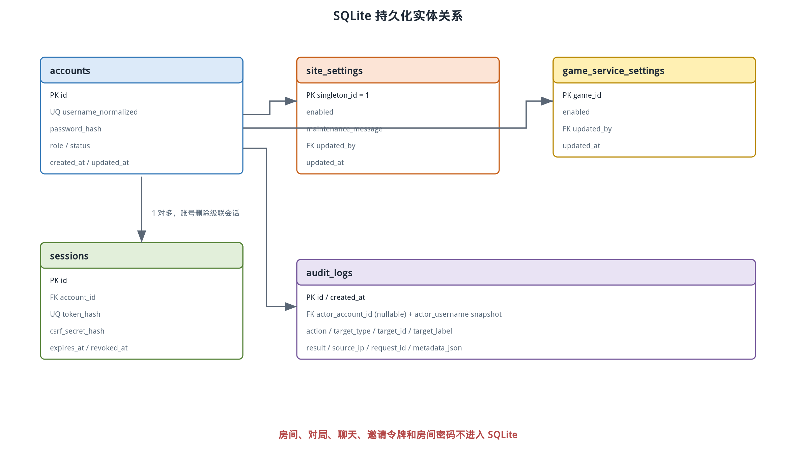

# Tabletop 数据模型设计

> 状态：实现基线（对应 `packages/database` 当前 schema 与初始迁移）
> 数据库：SQLite 3，WAL 模式
> ORM/迁移：Drizzle

## 1. 持久化边界

Tabletop 只持久化平台身份和管理数据：账号、登录会话、全站/单游戏开关、审计日志和 schema 版本。房间、对局、AI、聊天、邀请令牌和房间密码均只存在于服务进程内存。

这种边界是明确的产品选择，不是遗漏。服务器重启后所有房间作废，因此数据库不应保存无法完整恢复的局部房间记录；不保存历史战绩也避免对局结束事务与实时状态耦合。

## 2. 实体关系

下图展示五张业务表的关系。账号拥有多个设备会话；服务状态和审计日志独立保存，审计中的账号名称使用快照字段，避免目标账号删除后失去可读性。



图中没有房间表、对局表或聊天表。`audit_logs.actor_account_id` 可以在账号删除后置空，而 `actor_username` 与目标摘要继续保留到 30 天清理期限。

## 3. `accounts` 账号表

| 列 | 类型 | 约束与含义 |
| --- | --- | --- |
| `id` | TEXT | ULID 主键，不向用户展示 |
| `username` | TEXT | 去除首尾空白并经 NFKC 规范化后的显示名称，3～32 个 Unicode 码点 |
| `username_normalized` | TEXT | Unicode 规范化并对英文字母小写，唯一索引 |
| `password_hash` | TEXT | Argon2id 编码结果 |
| `role` | TEXT | `admin` 或 `user`，检查约束 |
| `status` | TEXT | `enabled` 或 `disabled`，检查约束 |
| `created_at` | INTEGER | UTC Unix 毫秒 |
| `updated_at` | INTEGER | UTC Unix 毫秒 |
| `password_changed_at` | INTEGER | 密码修改时间，用于审计与会话撤销 |

系统至多允许一个 `admin`。初始迁移创建 partial unique index `accounts_single_admin_unique`，仅对 `role = 'admin'` 的行生效；管理员初始化服务负责创建首个管理员，数据库不要求任意时刻都必须已有管理员。

用户名处理顺序固定为：去除首尾空白、Unicode NFKC、按 Unicode 码点检查 3～32 长度、校验中文/英文字母/数字/下划线/短横线字符集，最后仅把 ASCII 大写字母转为小写生成 `username_normalized`。创建和登录必须调用同一函数，不能由数据库默认 collation 决定中文与大小写行为。

账号删除采用硬删除，因为系统不保存战绩和内容归属。应用层先确认账号没有活动连接或房间成员身份，再删除账号；外键级联删除其会话，审计外键置空但保留用户名和目标快照。唯一管理员禁止删除和禁用。

## 4. `sessions` 会话表

| 列 | 类型 | 约束与含义 |
| --- | --- | --- |
| `id` | TEXT | 会话 ULID 主键，也是服务端设备身份 |
| `account_id` | TEXT | 外键指向账号，删除账号时级联删除 |
| `token_hash` | BLOB | 随机 Cookie 令牌使用 `SESSION_SECRET` 计算的 HMAC-SHA-256，唯一索引 |
| `csrf_secret_hash` | BLOB | CSRF 令牌使用 `SESSION_SECRET` 计算的 HMAC-SHA-256，固定 32 字节 |
| `created_at` | INTEGER | 创建时间 |
| `last_seen_at` | INTEGER | 节流更新的最近活动时间 |
| `expires_at` | INTEGER | 30 天滑动过期时间 |
| `revoked_at` | INTEGER NULL | 主动退出、禁用或密码变化时设置 |

浏览器 Cookie 保存随机令牌，数据库从不保存原值。查询条件包含 `revoked_at IS NULL`、`expires_at > now` 和账号仍为 `enabled`。滑动续期不在每个请求写库；当前仅在距离 `last_seen_at` 已满 24 小时后更新活动时间和新的 30 天到期时间。

“设备”在首期等价于一个登录会话。浏览器退出再登录会创建新 `sessionId`；一个会话最多绑定一个活动房间身份，绑定关系只保存在进程内连接目录中。

密码修改和管理员重置通过事务撤销目标账号的会话。本人修改密码时在同一事务中创建一个全新当前会话，提交后由 HTTP 响应设置新 Cookie；旧 Cookie 全部失效。部署时轮换 `SESSION_SECRET` 会改变摘要计算结果，因此数据库中尚未过期的旧会话也无法再解析。

## 5. 服务开关表

### 5.1 `site_settings`

| 列 | 类型 | 约束与含义 |
| --- | --- | --- |
| `singleton_id` | INTEGER | 固定为 1 的主键 |
| `enabled` | INTEGER | SQLite 布尔值，首次部署为 1 |
| `maintenance_message` | TEXT | 普通用户看到的简短中文提示 |
| `updated_at` | INTEGER | 最近变更时间；初始迁移种子值为 0，首次后台修改后写 UTC Unix 毫秒 |
| `updated_by` | TEXT NULL | 最近操作管理员账号外键；账号删除后置空，初始值也可为空 |

### 5.2 `game_service_settings`

| 列 | 类型 | 约束与含义 |
| --- | --- | --- |
| `game_id` | TEXT | 游戏 manifest ID 主键 |
| `enabled` | INTEGER | 是否启用，首次发现游戏默认为 1 |
| `updated_at` | INTEGER | 最近变更时间 |
| `updated_by` | TEXT NULL | 最近操作管理员账号外键；账号删除后置空，初始值也可为空 |

启动时服务端把编译注册表与 `game_service_settings` 对齐：新游戏插入默认启用记录；数据库中存在但当前构建未注册的游戏保留记录，不在游戏目录或后台已注册游戏列表展示，也不自动删除，以便回滚构建。

服务关闭事务先持久化开关并写审计，提交成功后才终止内存房间。如果进程在两者之间崩溃，重启本身已经清空房间，数据库开关仍是正确结果。

## 6. `audit_logs` 审计表

| 列 | 类型 | 约束与含义 |
| --- | --- | --- |
| `id` | TEXT | ULID 主键 |
| `created_at` | INTEGER | UTC Unix 毫秒，范围查询索引 |
| `actor_account_id` | TEXT NULL | 操作者账号，可在删除后置空 |
| `actor_username` | TEXT | 操作时用户名快照 |
| `action` | TEXT | 稳定动作代码 |
| `target_type` | TEXT | `account`、`site`、`game`、`session` 等 |
| `target_id` | TEXT NULL | 目标 ID，不保存密码或令牌 |
| `target_label` | TEXT NULL | 目标显示名快照 |
| `result` | TEXT | `success` 或 `failure` |
| `source_ip` | TEXT NULL | 经过可信代理解析后的来源 IP |
| `request_id` | TEXT | 关联 HTTP 日志 |
| `metadata_json` | TEXT | 经字段白名单处理的补充信息 |

审计动作至少包括：登录失败、账号创建、启停、删除、密码重置、管理员修改密码、全站启停、单游戏启停和 CSV 导出。普通游戏动作、聊天内容和房间状态不写入审计表。

`metadata_json` 只能写预先定义的安全键，例如失败原因代码或游戏 ID。密码、密码哈希、Cookie、CSRF 值、邀请令牌和完整请求体严禁写入。

## 7. Schema 轮廓

下面的 SQL 摘录表达关键约束。当前权威定义是 `packages/database/src/schema.ts`，初始迁移是 `packages/database/drizzle/0000_initial.sql`；部署通过 `packages/database/src/migrations.ts` 运行 Drizzle 迁移，不能绕过迁移直接手改生产表。

```sql
CREATE TABLE accounts (
  id TEXT PRIMARY KEY,
  username TEXT NOT NULL,
  username_normalized TEXT NOT NULL,
  password_hash TEXT NOT NULL,
  role TEXT NOT NULL CHECK (role IN ('admin', 'user')),
  status TEXT NOT NULL CHECK (status IN ('enabled', 'disabled')),
  created_at INTEGER NOT NULL,
  updated_at INTEGER NOT NULL,
  password_changed_at INTEGER NOT NULL
);

CREATE UNIQUE INDEX accounts_username_normalized_unique
  ON accounts (username_normalized);

CREATE UNIQUE INDEX accounts_single_admin_unique
  ON accounts (role)
  WHERE role = 'admin';

CREATE TABLE sessions (
  id TEXT PRIMARY KEY,
  account_id TEXT NOT NULL REFERENCES accounts(id) ON DELETE CASCADE,
  token_hash BLOB NOT NULL,
  csrf_secret_hash BLOB NOT NULL,
  created_at INTEGER NOT NULL,
  last_seen_at INTEGER NOT NULL,
  expires_at INTEGER NOT NULL,
  revoked_at INTEGER
);

CREATE UNIQUE INDEX sessions_token_hash_unique
  ON sessions (token_hash);
```

同一初始迁移还创建 `site_settings`、`game_service_settings`、`audit_logs`、全部索引和检查约束，并写入 `site_settings.singleton_id = 1` 的默认开启记录。连接初始化在迁移前启用并验证外键、WAL、busy timeout 与同步级别；迁移测试会从空数据库运行完整迁移，并验证幂等性、关键约束和外键行为。

## 8. 事务边界

以下操作必须在 SQLite 事务中完成：

- 创建账号与成功审计。
- 禁用账号、撤销全部会话与成功审计。
- 重置密码、更新时间、撤销会话与成功审计。
- 修改全站或游戏开关与成功审计。
- 删除离线账号及其会话与成功审计快照。

在线状态不在数据库中。删除账号、登录以及账号变更使用应用级账号锁；删除服务在锁内检查 WebSocket 连接目录和房间成员索引，只有账号既不在线也没有残留房间成员时才执行删除事务。

失败审计与失败业务操作不能强行放在同一回滚事务中，否则事务回滚会丢失失败记录。当前登录凭据失败以独立写入记录 `auth.login`；账号、密码和服务开关的成功操作与对应成功审计在同一短事务中完成。

## 9. SQLite 运行配置

应用连接初始化时设置并验证：

```text
PRAGMA journal_mode = WAL;
PRAGMA foreign_keys = ON;
PRAGMA busy_timeout = 5000;
PRAGMA synchronous = NORMAL;
```

WAL 允许备份和少量后台读写与登录并行。当前写入量极低，单写者不是瓶颈。`better-sqlite3` 的同步调用只允许出现在短 repository 操作中，禁止在事务中执行密码哈希、网络请求或大文件导出。

Argon2id 通过异步原生库计算，完成后才进入短数据库事务。游戏 AI 使用的 Worker Thread 与密码哈希、数据库访问相互独立。审计 CSV 使用每页 100 条的迭代读取和流式响应，避免一次把全部记录加载到内存。

## 10. 清理任务

网站进程启动时执行一次持久数据清理，之后每 24 小时执行以下操作：

1. 删除 `expires_at` 已过期或 `revoked_at` 超过保留窗口的会话。
2. 删除 `created_at` 超过 30 天的审计日志。

这两项由 `apps/server/src/maintenance.ts` 在一个短事务中完成。数据库在线备份不在网站进程内执行，而由独立的 `tabletop-backup.timer` 每日触发 `scripts/backup-db.sh`。

## 11. 备份与恢复

备份脚本使用 SQLite CLI 的 `.backup` 在线备份，不能在 WAL 活跃时只复制主 `.db` 文件。输出先写同目录临时文件，`PRAGMA integrity_check` 通过后再原子改名；每日备份保留 30 天，并与部署前备份共用文件锁。

恢复步骤是停止应用、保留损坏文件、校验目标备份、恢复到数据目录、运行迁移检查并启动服务。账号和开关可以恢复，对局和聊天按产品边界无法恢复。

备份只保存在当前服务器，因此可以防误操作和数据库逻辑损坏，不能防云盘或整台实例丢失。这一残余风险已经由用户接受。

## 12. 数据安全

- 数据库目录只允许专用 `tabletop` 用户访问，推荐权限 `0700`，数据库和备份文件 `0600`。
- 数据库、WAL、备份、环境变量和导出 CSV 均加入 `.gitignore`。
- 日志只记录账号 ID、用户名快照和请求 ID，不记录密码哈希与会话令牌。
- 管理员下载审计 CSV 时使用 `Content-Disposition: attachment`，并设置不缓存响应头。
- HTTP 临时模式无法保护传输中的登录密码；数据落盘安全不能替代 HTTPS。

## 13. 不采用 PostgreSQL 的原因

目标部署只有约十个账号、一个应用实例和极低写入频率。PostgreSQL 会额外占用内存、进程和备份运维，却不能改善内存房间的可用性。SQLite WAL 已满足事务、唯一约束、索引、迁移和在线备份要求。

只有当系统需要多个应用实例共享账号数据、大量审计并发写入、跨服务器高可用或持久化对局时，才重新评估 PostgreSQL。迁移时 repository 边界和 Drizzle schema 可以减少业务层改动。
