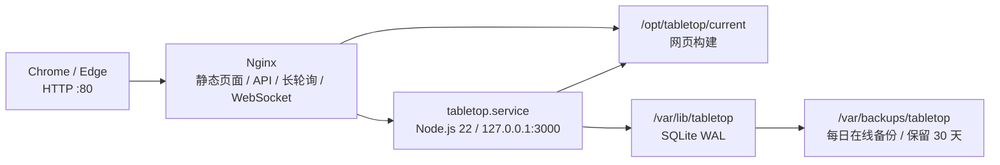

# Tabletop 部署与运维

> 部署方式：root 手动执行脚本，应用以 `tabletop` 低权限用户运行，不使用 Docker
> 首期入口：HTTP 80 端口；获得域名后必须切换 HTTPS

本文既描述生产拓扑，也提供首次部署、日常发布、备份恢复和故障处理步骤。管理员后台、开发分支到生产发布、日常启停和常用命令见[管理后台与日常运维](operations.md)。仓库内与本文对应的可执行资产如下：

| 路径 | 用途 |
| --- | --- |
| `scripts/provision-server.sh` | 幂等安装系统依赖、账号、目录、Nginx、systemd、Swap 和 UFW |
| `scripts/deploy.sh` | 获取代码、验证、构建、备份、迁移、原子发布和健康检查 |
| `scripts/backup-db.sh` | SQLite 在线备份、完整性检查和 30 天轮转 |
| `scripts/restore-db.sh` | 停服恢复、迁移、健康检查及失败时自动放回原数据库 |
| `scripts/operations.sh` | 已发布服务器的状态、日志、启停、发布、备份和恢复包装命令 |
| `scripts/migrate-db.mjs` | 调用已构建数据库包的正式迁移入口 |
| `deploy/tabletop.env.example` | 生产环境变量模板，不包含真实秘密 |
| `deploy/nginx/tabletop.conf` | HTTP、静态资源、API、长轮询和 WebSocket 入口 |
| `deploy/systemd/` | 应用 service 与每日备份 service/timer |

## 1. 部署拓扑



Nginx 是唯一公开的应用入口：直接提供 `apps/web/dist`，把 `/api/`（包含长轮询）和 `/ws` 转发到只监听 `127.0.0.1:3000` 的 Node.js 服务。账号、会话、服务开关和审计保存在 SQLite 中；房间与对局只保存在内存中，服务重启或发布会终止当前对局。

部署采用独立 release 目录。新版本在不影响当前服务的目录中完成安装、检查和构建，数据库备份后短暂停服迁移，再原子切换 `current` 符号链接。服务器保留最近两个 release。

## 2. 目录和权限

| 路径 | 所有者与权限 | 用途 |
| --- | --- | --- |
| `/opt/tabletop/repository` | `root:root`，0755 | 无工作树的 Git 仓库缓存，不运行应用 |
| `/opt/tabletop/releases/<时间>-<提交>` | `tabletop:tabletop` | 独立源码、依赖和构建产物 |
| `/opt/tabletop/current` | root 管理的符号链接 | 当前运行版本 |
| `/etc/tabletop/tabletop.env` | `root:tabletop`，0640 | 生产变量和会话秘密 |
| `/var/lib/tabletop/tabletop.db` | `tabletop:tabletop`，0600 | SQLite 主库 |
| `/var/backups/tabletop` | `tabletop:tabletop`，0700 | 本机备份和备份锁 |
| `/run/lock/tabletop-deploy.lock` | root | 防止部署与恢复并发执行 |

root 负责 provision、发布、恢复以及 systemd/Nginx 管理。网络进程始终以不可登录的 `tabletop` 系统用户运行；该用户只能写数据库、备份和自己的 release 构建目录，不能修改系统配置。

## 3. 首次准备

### 3.1 前置条件

1. 使用 root 登录受支持的 Linux 服务器。
2. 确认云安全组允许 TCP 22 和 80。脚本只能配置机器内的 UFW，不能修改云平台安全组。
3. 通过 HTTPS 把仓库检出到服务器上的临时管理目录，例如 `/root/tabletop-bootstrap`。仓库地址由执行者在本机配置，不写入仓库；服务器不配置代码托管平台的 SSH 密钥。
4. 确认工作目录中的部署资产来自准备发布的提交，而不是未审查的本地文件。

### 3.2 执行 provision

```bash
cd /root/tabletop-bootstrap
bash scripts/provision-server.sh
```

脚本可以重复执行，并完成以下操作：

1. 安装构建工具、Git、Nginx、SQLite CLI、UFW、Node.js 22 和固定版本 `pnpm@11.13.1`。
2. 创建 `tabletop` 系统用户和第 2 节目录，不覆盖已有数据库。
3. 首次创建 `/etc/tabletop/tabletop.env`，并在服务器本机生成 64 个十六进制字符的随机 `SESSION_SECRET`；重复执行保留现有环境文件和秘密。
4. 按服务器内存情况创建并启用 swap，把 `vm.swappiness` 设置为 10。
5. 安装 Nginx 与 systemd 配置，启用 Nginx、应用开机启动和每日备份 timer。首次发布前不会启动应用。
6. 启用 UFW，设置默认拒绝入站、允许出站，并增加 OpenSSH 和 `80/tcp` 放行规则。

provision 不会克隆应用 release、初始化管理员、创建数据库或启动尚未发布的应用。部署资产有修改时，应从新提交的检出目录重新运行 provision，使 `/etc/nginx` 和 `/etc/systemd/system` 与仓库同步；环境文件仍不会被覆盖。

### 3.3 检查环境文件

```bash
sed -n '1,200p' /etc/tabletop/tabletop.env
```

默认内容对应当前 IP/HTTP 部署：

```dotenv
NODE_ENV=production
HOST=127.0.0.1
PORT=3000
DATABASE_PATH=/var/lib/tabletop/tabletop.db
SESSION_SECRET=<由 provision 在服务器本机生成，不要复制到文档或 Git>
COOKIE_SECURE=false
TRUST_PROXY=loopback
LOG_LEVEL=info
GAME_AI_WORKERS=1
```

约束如下：

- `HOST` 必须保持 `127.0.0.1`，Node.js 端口不能直接暴露到公网。
- 当前 Nginx 和备份 unit 分别固定连接 `PORT=3000` 与 `/var/lib/tabletop/tabletop.db`。修改端口或数据库路径时必须同步修改部署资产，不能只改环境文件。
- `TRUST_PROXY=loopback` 只信任本机 Nginx 提供的代理地址。
- 受限内存服务器最多使用一个 AI Worker，因此 `GAME_AI_WORKERS` 只能是 `0` 或 `1`，生产默认 `1`。
- IP/HTTP 模式使用 `COOKIE_SECURE=false`。启用 HTTPS 后必须改为 `true`，然后重新登录验证 Cookie。
- 修改 `SESSION_SECRET` 会让所有现有会话立即失效。它至少 32 个字符，只存在于 root 可管理的环境文件中。

修改后验证权限：

```bash
chown root:tabletop /etc/tabletop/tabletop.env
chmod 0640 /etc/tabletop/tabletop.env
```

## 4. 发布

### 4.1 首次和日常发布

默认发布远端 `master` 最新提交：

```bash
bash scripts/deploy.sh
```

需要在服务器验证开发分支时，可显式选择 `develop`：

```bash
bash scripts/deploy.sh --branch develop
```

发布选定分支上的指定提交：

```bash
bash scripts/deploy.sh --branch master --revision <commit-sha>
```

发布脚本不内置仓库 URL。首次初始化服务器仓库缓存时，必须通过参数或当前命令环境提供 HTTPS 地址：

```bash
TABLETOP_REPOSITORY_URL='<repository-url>' \
  bash scripts/deploy.sh --branch master
```

首次指定的远端会保存在 `/opt/tabletop/repository`；后续发布默认复用该远端，也可以通过 `--repository-url` 或 `TABLETOP_REPOSITORY_URL` 显式更新。不要在 URL 中嵌入访问令牌；私有仓库应通过受保护的 HTTPS credential helper 或 `GIT_ASKPASS` 提供凭据。脚本只允许 `master` 或 `develop`，指定 commit 必须属于所选远端分支。

### 4.2 脚本执行顺序

`deploy.sh` 持有全局部署锁，并按以下顺序工作：

1. 获取所选远端分支并解析目标 commit。
2. 用 `git archive` 创建新的 release，应用用户执行 `pnpm install --frozen-lockfile`。
3. 以单 workspace 并发依次执行所有包的 `typecheck`、`test` 和 `build` 脚本，降低受限内存主机上的峰值。安装、检查和构建使用清理后的应用用户环境，不继承生产数据库路径或会话密钥；测试显式使用 `NODE_ENV=test`，构建显式使用 `NODE_ENV=production`。
4. 检查服务端、网页和数据库构建产物是否存在。
5. 主库已存在时执行 SQLite 在线发布前备份和 `PRAGMA integrity_check`。
6. 停止 `tabletop.service`，用目标 release 的数据库包显式执行 Drizzle migration。
7. 原子切换 `/opt/tabletop/current`，启动服务。
8. 在 30 秒内轮询 Node.js `/health/ready`，再通过 Nginx 检查 `/api/v1` 与网页入口。
9. 成功后删除更旧的 release，只保留当前和上一个版本。

构建、测试或备份失败发生在停服前，不影响当前版本。迁移、启动或健康检查失败发生在停服后，脚本会把 `current` 指回原 release 并重新启动原服务；失败 release 会保留供排障。

数据库迁移必须保持前后版本兼容，遵循“先添加、后使用、最后删除”的多版本发布策略。应用回滚不能自动撤销破坏性 schema 变化；涉及不兼容迁移时必须先停止发布并设计专门恢复步骤。

当前工作区没有独立的 `db:migrate` package script，服务启动时会通过 `openDatabase()` 自动迁移。生产发布为了把迁移结果与应用启动分开，使用 `scripts/migrate-db.mjs` 调用同一个已构建数据库包和 migration 目录；不要在生产库上改用 `drizzle-kit push` 或手写 SQL 代替该入口。

### 4.3 初始化管理员

首次成功发布后执行构建后的管理员 CLI。数据库路径若未改动，可直接运行：

```bash
runuser --user tabletop -- env \
  DATABASE_PATH=/var/lib/tabletop/tabletop.db \
  /usr/bin/node /opt/tabletop/current/apps/server/dist/cli/admin.js init
```

CLI 在终端中询问用户名、密码和二次确认，密码输入不回显。它拒绝创建第二个管理员。不要把管理员密码写进 shell 历史、环境文件或部署脚本。

## 5. Nginx 与 systemd

Nginx 配置包含：

- `/assets/` 提供带内容哈希的静态资源，缓存一年；SPA 页面和路由使用 `no-cache`。
- `/api/` 保留主机、来源地址和协议，关闭代理缓冲并转发到 Node.js；30 秒读取超时高于应用 15 秒的单次长轮询等待。
- `/ws` 使用 HTTP/1.1 Upgrade、关闭代理缓冲，读取超时 75 秒，高于应用 ping 周期。
- `/health/live` 与 `/health/ready` 只允许本机访问。
- 单个请求体上限 64 KiB，拒绝 dotfile 和 sourcemap 请求，并设置基础安全响应头。

`tabletop.service` 设置 10 秒应用优雅关闭窗口之外的 systemd 停止宽限、失败重启、文件描述符限制和以下主要沙箱：

- 只读系统目录，只允许写 `/var/lib/tabletop` 和私有临时目录。
- 清空 Linux capability，禁止提权、SUID/SGID、内核和控制组修改。
- 只允许 Unix、IPv4 和 IPv6 地址族。
- `MemoryHigh=1100M`、`MemoryMax=1400M`，为 Nginx、SQLite 页缓存和系统保留内存。

常用检查命令：

```bash
systemctl status tabletop nginx tabletop-backup.timer
journalctl -u tabletop --since today
nginx -t
curl --fail http://127.0.0.1:3000/health/ready
curl --fail http://127.0.0.1/api/v1
ss -lntp
```

预期只有 Nginx 监听公网 80，Node.js 3000 仅监听 `127.0.0.1`。

## 6. 备份

`tabletop-backup.timer` 每天 04:15 触发，并加入最多 15 分钟随机延迟。`Persistent=true` 表示机器错过执行时间后，会在下次开机补跑。

备份流程使用 SQLite `.backup` 在线接口，不直接复制可能处于 WAL 写入状态的主库。备份、发布迁移和恢复共用 `/var/backups/tabletop/.backup.lock`，因此不会交错修改数据库；临时文件通过完整性检查后才原子改名为：

```text
/var/backups/tabletop/tabletop-<UTC时间>-daily.sqlite3
```

发布前和恢复前备份使用不同 label，但统一保留 30 天。轮转按文件实际年龄删除超过 30 天的 `tabletop-*.sqlite3`；备份目录不会同步到服务器外。

手动触发和检查：

```bash
systemctl start tabletop-backup.service
systemctl status tabletop-backup.service
journalctl -u tabletop-backup --since today
find /var/backups/tabletop -maxdepth 1 -type f -name 'tabletop-*.sqlite3' -ls
```

手工运行脚本时应降权为应用用户：

```bash
runuser --user tabletop -- env \
  DATABASE_PATH=/var/lib/tabletop/tabletop.db \
  BACKUP_DIR=/var/backups/tabletop \
  /opt/tabletop/current/scripts/backup-db.sh --label manual
```

只保存在同一台服务器是明确的残余风险：磁盘或整机损坏会同时丢失主库和备份。当前需求接受该风险，但应定期下载一份备份做恢复演练。

## 7. 恢复

先列出备份并选择明确文件，不要根据文件名猜测：

```bash
ls -lh /var/backups/tabletop
bash /opt/tabletop/current/scripts/restore-db.sh \
  /var/backups/tabletop/tabletop-<UTC时间>-daily.sqlite3
```

交互确认后，恢复脚本会：

1. 检查候选备份的 `PRAGMA integrity_check`。
2. 获取与发布共用的锁，在线备份当前主库。
3. 停止应用，移除旧 WAL/SHM 辅助文件并原子替换主库。
4. 用当前 release 执行迁移，再启动并等待 readiness。
5. 若迁移或健康检查失败，自动放回恢复前备份并尝试启动原服务。

自动化环境可使用 `--yes` 跳过确认，但人工生产恢复不建议使用。恢复成功后至少验证管理员登录、账号列表和全站/单游戏开关；房间与对局本来就不持久化，无法恢复。

## 8. 故障处理

### 8.1 发布失败

先查看脚本最后一条错误，再检查：

```bash
systemctl status tabletop
journalctl -u tabletop -n 200 --no-pager
readlink -f /opt/tabletop/current
cat /opt/tabletop/current/.tabletop-release
df -h
free -h
```

停服前失败不会改变运行版本。停服后失败会自动恢复旧符号链接；若旧服务也无法启动，保持服务停止，检查数据库完整性，再按第 7 节恢复。不要手工删除当前或上一个 release。

已知稳定 commit 仍属于对应远端分支时，也可以重新发布它：

```bash
bash scripts/deploy.sh --branch master --revision <known-good-commit>
```

### 8.2 备份失败

备份失败不会删除主库或尚在 30 天内的有效备份。检查磁盘空间、目录权限和日志：

```bash
df -h /var/lib/tabletop /var/backups/tabletop
namei -l /var/backups/tabletop
journalctl -u tabletop-backup -n 100 --no-pager
sqlite3 /var/lib/tabletop/tabletop.db 'PRAGMA integrity_check;'
```

### 8.3 服务异常

`/health/live` 只表示进程响应；`/health/ready` 还检查 SQLite 可查询。ready 返回 503 时不要反复重启，先保留日志并检查数据库、权限和磁盘。应用自身每天清理过期会话和超过 30 天的审计记录，不需要另一个 systemd 清理 timer。

## 9. HTTP 临时模式

明文 HTTP 只能用于阶段性联调，不是安全的长期生产入口。用户名、密码和 Cookie 在传输中没有 TLS 保护；Argon2id、HttpOnly、SameSite、CSRF 和限流都不能替代链路加密。

获得域名后应完成：

1. 配置 DNS 与云安全组 443。
2. 安装受信任证书，让 Nginx 监听 443，并将 80 永久重定向到 HTTPS。
3. 把 `/etc/tabletop/tabletop.env` 的 `COOKIE_SECURE` 改为 `true`。
4. 重启应用，清理旧 Cookie，重新验证登录、改密、管理接口、WebSocket Origin 和长轮询 CSRF。

证书和私钥只能保存在服务器受限目录中，不能加入本仓库。

## 10. 验收清单

- 服务器重启后 Nginx 与 Tabletop 自动启动，SQLite 数据和服务开关保留。
- UFW 与云安全组只开放必要的 22、80；公网无法连接 3000。
- 普通用户不能注册，管理员 CLI 只能初始化一个管理员，后台可以管理账号和服务开关。
- 两个浏览器可以建立房间、完成 WebSocket 对局、聊天和 30 秒内重连；模拟 WebSocket 被禁用后可通过 HTTP 长轮询完成建连、进房和房间命令。
- 发布会终止内存对局但保留账号数据；构建或健康检查失败不留下半发布版本。
- 每日备份 timer 正常运行，备份能通过完整性检查，30 天轮转生效。
- 从实际备份完成一次恢复演练，账号、会话规则和服务开关符合预期。
- 1280x720 与 1920x1080 的 Chrome/Edge 页面可正常使用。
