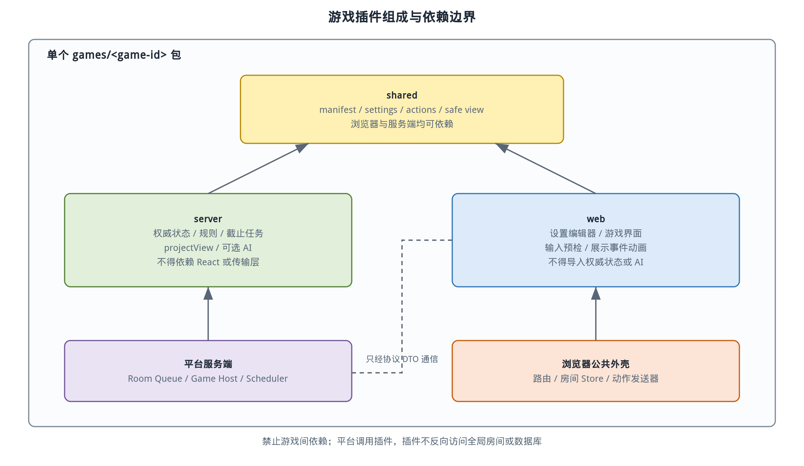
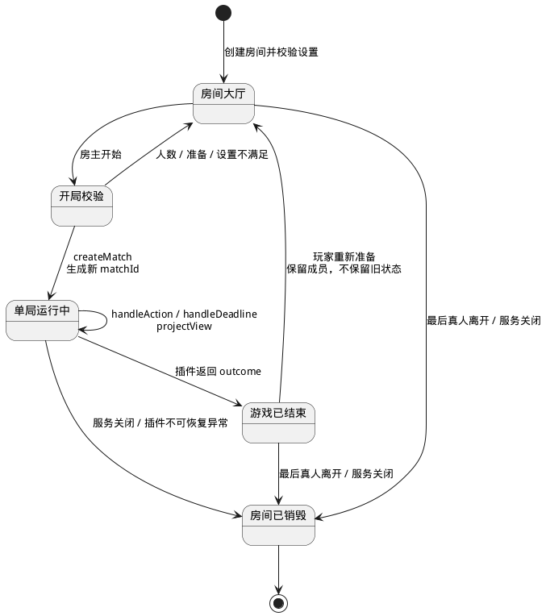

# 游戏插件扩展指南

> 状态：已实现的 SDK v1 扩展基线
> SDK 版本：v1
> 读者：新增或维护桌游的核心开发者

## 1. 插件模型

Tabletop 的游戏插件不是可下载的外部程序，也不是独立部署的网站。一个插件是 monorepo 中随平台一起编译的 TypeScript 模块集合，分为共享协议、服务端规则、浏览器界面和可选 AI。

这种拆分允许每个游戏拥有完全不同的规则与交互，同时强制复用账号、房间、座位、连接、聊天和服务开关。平台核心只调用稳定 SDK，不通过条件分支识别具体游戏。

下图展示插件四部分与公共平台的依赖方向。箭头只允许指向公共 SDK 或本游戏共享模块，游戏之间不能互相引用。



图中的服务端模块持有权威规则，浏览器模块只接收投影视图。共享模块不能暴露服务端隐藏状态，否则未来卡牌或身份游戏可能把秘密字段打进浏览器 bundle。

## 2. 目录约定

新增游戏使用以下目录骨架：

```text
games/<game-id>/
├── package.json
├── tsconfig.json
├── tsconfig.build.json
├── vitest.config.ts
├── shared/
│   ├── index.ts
│   ├── contract.ts
│   ├── manifest.ts
│   ├── settings.ts
│   ├── actions.ts
│   └── view.ts
├── server/
│   ├── index.ts
│   ├── module.ts
│   ├── rules/
│   └── ai/                 # 可选
├── web/
│   ├── index.ts
│   ├── module.tsx
│   ├── GameView.tsx        # 可内联在 module.tsx
│   └── GameSettings.tsx    # 可选，也可内联
└── tests/
```

`shared` 只能放浏览器可以安全获得的内容；完整权威状态定义放在 `server`。大型素材放在游戏自己的可发布资源目录中（例如 `web/assets`，或与描述文件同目录的 `scenes/<mode>`），经构建流程复制或由 Vite 使用内容哈希发布。

需要共同设计视觉元素和碰撞几何时，可以使用仓库的
[2D 场景与碰撞区编辑器](scene-editor.md)导出 `tabletop.scene/v1` 描述文件，
并通过 `@tabletop/scene` 在游戏中使用同一套坐标变换、Canvas 绘制和命中检测。

仓库已经提供不进入游戏注册表的 `games/template`。模板包含独立 package exports、最小 manifest、共享设置/动作/视图 schema、服务端状态迁移、浏览器设置与视图组件以及宿主适配器测试；复制模板后必须替换 package 名、导出符号、动作命名空间和 `gameId`。模板本身不注册为可玩的游戏。

## 3. Manifest 与能力声明

每个游戏先声明稳定身份和宿主需要理解的能力。权威 schema 位于 `packages/game-sdk/src/shared/manifest.ts`，当前 v1 结构如下：

```ts
type InteractionMode = "turn_based" | "simultaneous" | "realtime";

interface GameManifestV1 {
  apiVersion: 1;
  gameId: string;
  displayName: string;
  description: string;
  minPlayers: number;
  maxPlayers: number;
  interactionMode: InteractionMode;
  capabilities: {
    spectators: boolean;
    midgameJoin: boolean;
    timers: boolean;
    hiddenInformation: boolean;
    bots: boolean;
    soloPractice: boolean;
    temporaryController: boolean;
    manualSeatReclaim: boolean;
  };
}
```

Manifest 用于首页、房间容量和宿主能力门控，不用于描述具体棋盘规则。`bots` 表示插件提供服务器 Bot provider，`soloPractice` 表示练习房允许仅一个真人且不添加 Bot；两者相互独立，普通联机房始终遵守 `minPlayers`。当前 v1 宿主只接受 `turn_based`，但保留另外两个枚举值，未来通过新的宿主能力版本启用。

`gameId` 一经进入 `master` 不能更改，使用小写字母、数字和短横线；显示名称可以调整。玩家数指真人和 AI 座位总数，不包含观众。

`defineGameServerModuleV1` 在注册前校验 `bots` 与 bot provider、`temporaryController` 与 fallback provider 必须成对出现；同时校验 AI profile 唯一性，并对自定义 lobby 在默认设置下返回的座位检查 ID 唯一和数量范围。服务端注册表当前拒绝非 `turn_based` 模块。

### 3.1 游戏目录与 `botProfiles`

`botProfiles` 不是 manifest 字段，而是服务端从可选 `bot.listProfiles()` 取得的公开目录元数据。`GET /api/v1/games` 对每个已注册游戏返回 manifest 摘要、服务启停状态和以下数组；没有可配置 AI 的插件返回空数组：

```ts
interface BotProfileV1 {
  profileId: string;
  displayName: string;
  description: string;
  timeBudgetMs: number;
}
```

`profileId` 在单个插件内唯一且稳定，`timeBudgetMs` 是服务端执行硬预算。目录中的 profile 用于房主添加 AI、练习房选择和展示选项；断线/超时兜底控制器不出现在该数组中。声明 `bots` 的练习房由平台用所选 `botProfileId` 填充真人之外的座位；仅声明 `soloPractice` 的练习房只占用首个真人座位并保留其他座位为空，其他成员可以观战但不能再占座。两种流程都以“已占座位均已准备”的上下文调用 `validateStart` 做结构性预检；插件应在该入口拒绝不兼容的设置或座位组合，不要让平台按 `gameId` 特判。

## 4. 设置合同

插件必须通过共享合同提供 Zod schema、默认值和房间摘要格式化函数，并可通过 Web 模块提供自定义 React 设置组件。宿主始终使用 schema 校验，不能信任浏览器表单。

```ts
interface GameSettingsContractV1<TSettings> {
  schema: z.ZodType<TSettings>;
  defaultValue: TSettings;
  summarize(settings: Readonly<TSettings>): readonly {
    label: string;
    value: string;
  }[];
}
```

`GameWebModuleV1.SettingsEditor` 是可选字段。当前公共创建页在插件没有提供编辑器时直接使用默认设置，不从任意 Zod schema 自动生成表单；复杂插件应提供自己的设置组件。自定义组件仍然只能产出 `TSettings`，服务端 schema 是唯一有效边界。

设置只能在未开局或一局结束后修改。修改成功由平台清除所有真人准备状态，插件无需重复实现。

共享合同还可以声明 `transientEventSchema`，用于瞄准、光标等允许丢包的临时展示数据。宿主会在服务端转发前和浏览器接收后各校验一次该 schema；未声明时拒绝发送。临时事件不进入 `handleAction`，不改变状态或修订号，也不能承载任何规则判定依据。

## 5. 服务端插件合同

服务端插件把任意合法动作转换成新的不可变状态。权威接口位于 `packages/game-sdk/src/server/module.ts`；下面省略泛型约束，仅展示当前结构。接口刻意不暴露 WebSocket、长轮询、数据库或房间可变对象。

```ts
interface GameServerModuleV1<TSettings, TState, TAction, TView, TDisplayEvent> {
  shared: GameSharedContractV1<TSettings, TAction, TView, TDisplayEvent>;
  lobby?: GameLobbyContractV1<TSettings>;

  createMatch(context: CreateMatchContextV1, settings: Readonly<TSettings>): TState;

  handleAction(
    context: ActionContextV1,
    state: Readonly<TState>,
    action: TAction
  ): GameTransitionV1<TState, TDisplayEvent>;

  projectView(
    context: ProjectionContextV1,
    state: Readonly<TState>,
    viewer: ViewerV1
  ): TView;

  getDeadlines(state: Readonly<TState>): readonly GameDeadlineV1[];
  handleDeadline(
    context: DeadlineContextV1,
    state: Readonly<TState>,
    deadline: GameDeadlineV1
  ): GameTransitionV1<TState, TDisplayEvent>;

  handleSystemEvent(
    context: SystemEventContextV1,
    state: Readonly<TState>,
    event: GameSystemEventV1
  ): GameTransitionV1<TState, TDisplayEvent>;

  getActiveSeatIds?(state: Readonly<TState>): readonly SeatId[];
  fallbackController?: GameFallbackControllerV1<TState, TAction>;
  bot?: GameBotProviderV1<TState, TAction>;
}
```

`shared` 同时携带 manifest、设置合同、动作 schema、投影视图 schema 和展示事件 schema。`lobby` 可以按设置返回座位定义并补充开局校验；未提供时宿主按 manifest 的 `maxPlayers` 创建默认座位。`getActiveSeatIds` 告诉宿主当前哪些座位需要自动控制器调度，未提供时不调度 AI。

`handleAction` 必须是可测试的确定性转换：相同状态、动作和注入上下文产生相同结果。当前时间和随机数从 `context` 获取，禁止直接调用 `Date.now()` 或 `Math.random()`。它可以返回新状态、展示事件和需要调度的副作用描述，但不能自行发送网络消息。

`projectView` 是信息安全边界。它按玩家座位、观众或自动控制器身份创建新对象，不能返回内部状态引用。即使某个插件当前没有隐藏信息，也必须经过投影，不能因规则简单而绕过统一边界。

## 6. 动作与转换结果

游戏动作使用可辨识联合类型。动作中不携带账号、座位或当前时间，这些字段由宿主从认证连接和房间状态注入。

```ts
type ExampleAction =
  | { type: "turn.choose"; optionId: string }
  | { type: "phase.confirm" }
  | { type: "match.forfeit" };

type GameTransitionV1<TState, TDisplayEvent> =
  | {
      kind: "noop";
      state: TState;
    }
  | {
      kind: "applied";
      state: TState;
      events: readonly TDisplayEvent[];
      outcome?: GameOutcomeV1;
      roomDirectives?: readonly GameRoomDirectiveV1[];
    };

interface GameOutcomeV1 {
  kind: "completed";
  publicSummary?: JsonValue;
}
```

`noop` 明确表示命令合法但没有状态变化；`applied` 才会替换状态、执行房间指令并触发新快照。无论是哪一种成功结果，协议层都以 `command.ack.payload.stateChanged` 告知调用方是否改变状态。

动作 schema 与类型放在 `shared/actions.ts`，服务端在进入规则前做运行时校验。动作类型使用带命名空间的稳定字符串，新增动作不重用旧名称。

展示事件描述“已经发生了什么”，用于客户端动画，例如组件状态变化、阶段切换或结果高亮。事件不能成为权威状态，客户端丢失事件后仍能只凭下一份完整快照正确显示。

非法动作通过 SDK 定义的 `GameRuleError` 返回稳定 `ruleCode`。SDK 类型允许插件附带 `publicDetails`，但当前房间运行时只把 `ruleCode` 放入 `command.error.payload.details`；浏览器模块用 `formatRuleError` 映射文案，内部异常栈和隐藏状态不会发给客户端。

## 7. 游戏生命周期

游戏实例只负责单局，房间负责大厅和再来一局。生命周期如下图所示。



创建房间时只校验设置，不创建游戏状态。所有座位满足开始条件且房主开始后，宿主调用 `createMatch`。结束状态由插件结果产生，但房间继续存在；再次准备后创建全新 `matchId` 和状态。非对局阶段成员断开会立即移除；对局阶段最后一个 `connected` 或 `reconnecting` 成员退出后会销毁房间。关闭服务也会销毁房间；单次插件命令异常由网关返回内部错误，当前不会自动销毁房间。

插件不能依赖完整上局状态。需要在再来一局中使用上局公开信息时，房间通过 `CreateMatchContextV1.previousSummary` 提供前一 `matchId` 和插件上次 outcome 写入的可选 `publicSummary`；它不提供完整旧状态。

### 7.1 连接与成员系统事件

平台在非对局阶段直接清理离开的成员，只为对局阶段的页面离开、刷新、关闭、网络中断或传输失效维护 30 秒恢复窗口，不决定连接变化对比赛的含义。这些被动断开表现为 `connection.lost`；用户确认手动退出或账号被强制移除表现为 `member.left`，不会先进入恢复窗口。房间队列在确定顺序点调用 `handleSystemEvent`，当前 v1 事件类型为：

```ts
type GameSystemEventV1 =
  | { type: "connection.lost"; seatId: SeatId; graceDeadlineMs: number }
  | { type: "connection.restored"; seatId: SeatId }
  | { type: "connection.grace_expired"; seatId: SeatId }
  | { type: "seat.reclaim_requested"; seatId: SeatId }
  | { type: "member.left"; seatId: SeatId };

type GameRoomDirectiveV1 =
  | { type: "seat.useFallbackController"; seatId: SeatId }
  | { type: "seat.returnHumanControl"; seatId: SeatId }
  | { type: "seat.release"; seatId: SeatId }
  | { type: "seat.setReclaimable"; seatId: SeatId; reclaimable: boolean };
```

事件只描述平台事实，指令只描述平台能够执行的通用房间变化。插件通过 `outcome` 决定是否结束比赛，通过 `roomDirectives` 决定控制器和座位策略。`member.left` 或 `connection.grace_expired` 处理完成后平台总会移除成员、清空账号当前房间并清除座位取回权限；插件只能决定退出后的比赛结果、自动控制或座位释放。具体游戏必须在自己的文档中说明每个事件返回什么；平台核心不得根据 `gameId` 补充默认结局。

`connection.restored` 只表示同一账号在窗口内通过验证，不要求沿用原登录会话。插件可以返回真人控制，也可以因为比赛已经结束而不返回指令。任何已提交的自动动作都不会由平台自动回滚。

`connection.lost.graceDeadlineMs` 是 30 秒窗口结束的 UTC Unix 毫秒时间。主动退出或窗口到期后的成员删除、账号当前房间清空和房主转移由平台统一完成，不属于插件指令；插件只决定比赛 outcome、座位 controller 和座位释放。退出座位不得设置为可取回。

## 8. 随机数与时间

宿主向每局提供随机接口，插件只能在收到注入上下文的生命周期回调中请求随机值。接口记录用途标签，便于测试注入固定结果和排障。

```ts
interface GameRandomV1 {
  integer(minInclusive: number, maxInclusive: number, label: string): number;
  pick<T>(items: readonly T[], label: string): T;
}

interface GameClockV1 {
  monotonicMs(): number;
}

interface GameDeadlineV1 {
  deadlineId: string;
  dueAtMonotonicMs: number;
  payload?: JsonValue;
}
```

生产实现使用服务端安全随机源；测试实现使用显式序列，不要求公开随机种子。时间使用单调时钟计算耗时，持久审计时间才使用 UTC 墙上时钟。

插件通过 `getDeadlines` 暴露当前有效截止任务。宿主调度到期后带当前修订号调用 `handleDeadline`，插件仍需重新验证任务是否适用于当前状态。

## 9. 玩家视图与隐藏信息

`ViewerV1` 区分玩家座位、观众和系统 AI：

```ts
type ViewerV1 =
  | { kind: "player"; seatId: SeatId }
  | { kind: "spectator" }
  | { kind: "bot"; seatId: SeatId };
```

玩家视图只包含渲染和可用操作提示所需信息。服务端仍会重新验证动作，所以 `legalActions` 或其他操作提示只是便利数据。观众默认只看公开信息；隐藏信息插件不得用“前端隐藏 CSS”代替服务端裁剪。

AI 获得对应座位可见信息和宿主生成的合法上下文，不得直接读取权威状态中的其他玩家秘密。若某种 AI 确实需要规则内部结构，应由插件创建专门的安全 bot view，而不是传入完整状态。

## 10. AI 与兜底控制器

房主可添加的 AI 和系统事件使用的兜底控制器都是可选能力。插件分别通过 `bots`、`temporaryController` capability 声明支持情况；两者都只返回动作意图，宿主再走普通动作校验入口。

```ts
interface AutomatedActionRequestV1<TInput> {
  seatId: SeatId;
  input: Readonly<TInput>;
  revision: number;
  hardDeadlineMonotonicMs: number;
  decisionSeed: string;
}

interface GameBotProviderV1<TState, TAction, TInput> {
  inputSchema: z.ZodType<TInput>;
  listProfiles(): readonly BotProfileV1[];
  createInput(
    context: AutomationInputContextV1,
    state: Readonly<TState>,
    seatId: SeatId
  ): TInput;
  chooseAction(
    request: AutomatedActionRequestV1<TInput> & { profileId: string }
  ): Promise<TAction>;
}

interface GameFallbackControllerV1<TState, TAction, TInput> {
  inputSchema: z.ZodType<TInput>;
  createInput(
    context: AutomationInputContextV1,
    state: Readonly<TState>,
    seatId: SeatId
  ): TInput;
  chooseFallbackAction(
    request: AutomatedActionRequestV1<TInput>,
    reason: "disconnect" | "timeout"
  ): Promise<TAction>;
}
```

插件只在 `createInput` 中接触权威状态，并必须产出通过 `inputSchema` 的 JSON 安全值；Worker 只接收该输入、座位、当前修订号、硬截止时间和决策种子。宿主等待 AI 时不锁住房间队列或事件循环；返回后若 `matchId`、修订号、行动座位或控制器已经变化则丢弃结果，并按当前状态重新调度。

兜底控制器只要求在宿主预算内产生合法动作，不承诺策略质量，也不出现在房间 AI profile 列表。当前 v1 对兜底动作使用 250 ms 预算；插件可以只提供可配置 AI、只提供兜底控制器、两者都提供或都不提供。缺少兜底控制器时，连接事件仍由 `handleSystemEvent` 决定比赛状态。

AI 或兜底控制器超时、抛错或返回非法动作时，当前宿主丢弃该自动化任务并保留权威状态，不会通过直接改状态“帮 AI 走一步”，也不会自动合成 pass。需要保证流程最终推进的插件必须通过自身截止任务或可靠的合法动作降级设计完成。

生产运行时默认使用 `SingleWorkerAutomationExecutor`：全站共享一个 Worker、队列最多 128 个待处理任务、任务超过预算加 250 ms 的终止余量时重建 Worker，并对 Worker 故障最多重试一次。可配置 AI 的预算来自 profile；当前兜底动作使用平台 250 ms 预算。Worker 返回值仍会经过插件动作 schema，并通过普通 `handleAction` 入口执行。

## 11. 浏览器插件合同

浏览器模块按 `gameId` 注册设置与对局组件：

```ts
interface GameWebModuleV1<TSettings, TAction, TView, TDisplayEvent> {
  shared: GameSharedContractV1<TSettings, TAction, TView, TDisplayEvent>;
  SettingsEditor?: React.ComponentType<GameSettingsPropsV1<TSettings>>;
  GameView: React.ComponentType<GameViewPropsV1<TView, TAction, TDisplayEvent>>;
  formatRuleError?(ruleCode: string, details: JsonObject): string;
}
```

`GameView` 接收最新完整投影视图、尚未播放的展示事件、发送动作函数和只读连接状态。声明临时事件 schema 的插件还可使用 `dispatchTransientEvent` 和最近收到的 `transientEvent`；后者包含服务端生成的 `senderSeatId`。插件应按当前投影中的行动座位、阶段和本地序号过滤延迟事件，并始终允许事件缺失。它不能访问原始 WebSocket 或长轮询，也不能修改公共房间 store。这样平台可以统一处理请求 ID、修订号、错误提示、限频降级和重连。

插件可以用 DOM、CSS、Canvas 或 SVG 实现游戏操作面。首期二维界面优先使用 DOM/CSS 或 Canvas，不引入 3D。固定格式区域必须有稳定尺寸约束，动画元素不得撑开布局。

## 12. 注册与构建

当前采用显式注册表，不扫描文件系统或动态 import 任意路径。服务端组合根是 `apps/server/src/games/registry.ts`，浏览器组合根是 `apps/web/src/games/registry.ts`；只有这两个文件可以导入具体游戏包：

```ts
export const serverGameRegistry = registerServerGamesV1([
  firstServerModule,
  secondServerModule,
]);

export const webGameRegistry = registerWebGamesV1([
  firstWebModule,
  secondWebModule,
]);
```

两个注册表都会拒绝重复 `gameId`，服务端注册表还拒绝当前宿主不支持的交互模式。`assertManifestCompatibilityV1` 可比较两端 manifest 的 `gameId`、SDK 主版本、玩家数、交互模式和能力摘要。服务端 `GET /api/v1/games` 是运行时目录真相；浏览器按返回的 `gameId` 查找 Web 模块，缺少模块时必须显示版本错误。

根命令 `pnpm check:architecture` 运行 `scripts/check-game-boundaries.mjs`。该守卫从 `games/*` 推导具体游戏 ID，检查除两个组合根外的 `apps/*/src` 与 `packages`：生产文件不得导入 `@tabletop/game-<game-id>/...`，也不得按具体 `gameId` 写规则分支。测试文件可以引用具体插件做端到端验证，但公共生产实现不能。

## 13. 接入新游戏步骤

1. 复制 `games/template` 为 `games/<game-id>`，替换 package 名、导出符号、动作命名空间和唯一 `gameId`，填写 manifest 与能力。
2. 在 `docs/games/<game-id>.md` 编写独立规则文档，明确参与人数、隐藏信息、阶段、动作、随机、超时、退出和胜负；平台文档只链接它，不复制具体规则。
3. 定义设置 schema、默认值、共享动作和安全投影视图。
4. 在服务端实现初始状态、动作转换、系统事件、截止任务、视图投影和结束判定。
5. 如有 AI，定义 profile、可见信息、时间预算和失败降级动作。
6. 实现设置编辑器和游戏界面，使用平台动作发送器，不自行管理连接。
7. 添加规则边界与完整对局测试，固定随机序列验证重放一致性。
8. 同时加入 `apps/server/src/games/registry.ts` 和 `apps/web/src/games/registry.ts`，运行 manifest 兼容检查、`pnpm check:architecture`、类型检查、测试和构建。
9. 补充游戏文档、图片、素材授权和管理员启停说明。
10. 在 `develop` 完成端到端联机验证后再进入 `master`。

## 14. 插件验收清单

| 类别 | 必须满足 |
| --- | --- |
| 身份 | `gameId` 唯一，manifest 两端一致，`apiVersion: 1` 可用，目录 `botProfiles` 合法 |
| 设置 | 浏览器与服务端共享 schema，非法值有稳定错误 |
| 规则 | 所有状态变化经过 `handleAction`、`handleDeadline` 或 `handleSystemEvent` |
| 投影 | 玩家、观众和 AI 看不到无权信息 |
| 时间 | 不直接调用系统时间，截止任务可在测试中控制 |
| 随机 | 不直接调用 `Math.random()`，测试可注入固定序列 |
| AI | 只返回普通动作，硬超时后有合法降级 |
| 网络 | 刷新快照即可恢复，不依赖未保存的客户端局部状态 |
| 生命周期 | 开始、结束、再来一局、连接事件、退出和服务关闭都有确定行为 |
| 文档 | 独立规则、状态、动作、异常、UI 和测试说明齐全 |

## 15. 兼容与演进

SDK v1 同一主版本只增加可选 capability、带默认实现的宿主能力或新错误码。若必须改变动作上下文、投影安全语义或生命周期，则发布 v2，并在迁移期让宿主同时接受两个入口。

不要仅为了假设中的未来游戏提前加入通用物理组件、规则 DSL 或脚本解释器。遇到多个真实插件需要相同能力时，再把经过验证的重复逻辑提升到 SDK。当前 v1 已由两个交互和状态模型不同的注册插件以及未注册模板共同验证；公共层不能出现按具体 `gameId` 分支的规则代码。
