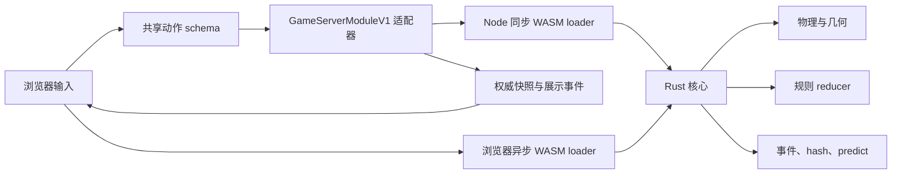

# 台球 Rust/WASM 架构与实现边界

## 1. 范围与状态

台球插件位于 `games/billiards`，提供中式八球、斯诺克双人对局和单人练习。浏览器负责输入和动画，服务端负责权限、回合与最终裁决；客户端不能提交球位、得分、犯规或胜负。

本版本已将原 TypeScript 固定步长物理实现替换为独立 Rust 核心，并把同一份 release WASM 同时用于 Node 服务端和浏览器回放。Rust 核心包含：

- 运动状态、事件预测、碰撞与袋口求解；
- 中式八球、斯诺克和练习模式的纯函数规则 reducer；
- 初始摆球、置球校验和规则决策状态；
- 每杆事件记录、状态哈希和有界轨迹预测。

本文用以下措辞区分能力边界：

- **产品实现**：本仓库 Rust/WASM 核心、TypeScript 框架适配器和协议共同提供的能力。
- **Pooltool 固定基线**：逐公式、逐参数移植固定提交的默认二维 resolver、事件选择和预制桌型；不表示 Rust 与 Python 在所有平台逐 bit 相同。
- **未完整实现**：需要裁判判断、器材标定或更完整三维接触模型的已知边界，不宣称与正式赛事完全一致。

## 2. 与原框架的接入

原有 `GameServerModuleV1` 同步回调、房间快照、共享动作 schema 和临时瞄准事件等框架合同保持兼容。展示事件 schema 只向后兼容地新增可空的物理版本与状态 hash 字段，旧事件仍可解析。WASM 作为插件内部实现细节，不改变平台的同步服务端回调合同。



主要边界如下：

- `games/billiards/native/src` 是 Rust 权威核心。它导出小型 JSON/线性内存 ABI，支持 `ping`、`simulate`、`predict`、`create-match` 和 `reduce-action`，不依赖 Python 或 `wasm-bindgen` 运行时。
- `games/billiards/physics/index.ts` 在 Node 中加载并复用单个 WASM 实例，保留同步 `simulateBilliardsShot` 接口，因此现有服务端模块不需要改成异步。
- `games/billiards/physics/browser.ts` 按需异步获取并缓存同一 WASM，用于展示事件回放和轨迹预测。
- 服务端先运行权威物理，再把不可变的物理摘要交给 Rust 规则 reducer；reducer 返回新的比赛状态，不读取全局状态，也不自行获取随机数。
- 决胜黑球需要掷币时，平台权威随机源先选出座位索引，再把该索引注入 reducer。测试和重放可注入固定索引；断线、离房、展示事件组装和房间完成通知仍属于平台适配层。
- 原 TypeScript 规则实现已移除；在线对局与规则测试都通过 Rust rules ABI，避免两套裁决逻辑产生分叉。

WASM 构建产物使用插件内的稳定相对路径 `games/billiards/native/generated/tabletop_billiards_core.wasm`。打包后会复制到 `dist/native/generated`；不要在代码或文档中写入开发机路径。

## 3. Pooltool 固定基线与兼容边界

研究基线固定为 Pooltool commit [`9a8abfe0da4c3b588dd7779e7f8530123170e742`](https://github.com/ekiefl/pooltool/tree/9a8abfe0da4c3b588dd7779e7f8530123170e742)，避免上游后续演进改变本文所指的行为。Pooltool 的 [JOSS 论文](https://joss.theoj.org/papers/10.21105/joss.07301)将其定位为面向科研与工程的通用 Python 台球模拟器；其事件驱动算法会解析下一次碰撞或运动状态变化并直接演化到该时刻。

Rust 物理核心直接按下列固定版本实现：

- [算法博客](https://ekiefl.github.io/2020/12/20/pooltool-alg/)中的连续事件驱动循环；
- [物理 theory 系列](https://ekiefl.github.io/2020/04/24/pooltool-theory/)中的静止、自转、滑动、滚动和腾空分段模型；
- 固定版本的[事件循环](https://github.com/ekiefl/pooltool/blob/9a8abfe0da4c3b588dd7779e7f8530123170e742/pooltool/evolution/event_based/simulate.py)、[运动演化](https://github.com/ekiefl/pooltool/blob/9a8abfe0da4c3b588dd7779e7f8530123170e742/pooltool/physics/evolve/__init__.py)、[球球碰撞时间](https://github.com/ekiefl/pooltool/blob/9a8abfe0da4c3b588dd7779e7f8530123170e742/pooltool/evolution/event_based/detect/ball_ball.py)和[球桌布局](https://github.com/ekiefl/pooltool/blob/9a8abfe0da4c3b588dd7779e7f8530123170e742/pooltool/objects/table/layout.py)；
- Pooltool [官方文档](https://pooltool.readthedocs.io/en/stable/)对事件、物体和可替换物理策略的组织方式。

采用该提交 `default_resolver()` 的固定组合：

- 球球：`FrictionalInelastic` 与 `AlciatoreBallBallFriction(a=0.009951, b=0.108, c=1.088)`；
- 直线库与圆形袋角：`StrongeCompliant`，`omega_ratio=1.8`；
- 球袋：`CanonicalBallPocket`；
- 球杆：`InstantaneousPoint2D`，english 与 squirt throttle 均为 `1`；
- 球桌：`FrictionalInelasticTable(min_bounce_height=0.005)`；
- 滑动、滚动、自转与状态转换：canonical 分段演化。

兼容边界如下：

| 领域 | 固定 Pooltool 版本的边界 | 本产品的处理 |
| --- | --- | --- |
| 同时事件 | 事件循环每次只选择并解析一个下一事件；严格同时时按事件 tier 与能量排序 | 保持相同的单事件语义，解析后使相关旧预测失效并重算，不再使用 PGS |
| 比赛规则 | 上游 [ruleset](https://github.com/ekiefl/pooltool/tree/9a8abfe/pooltool/ruleset) 中的 `eight_ball` 是通用八球规则，不是 WPA Heyball profile；Snooker ruleset 不完整覆盖推杆、跳球、miss、离台和完整裁判流程 | 独立 Rust profile 按本产品明确范围处理回合、犯规、计分、摆球和决策 |
| 击球 | 上游默认输入 `V0` 是 m/s，且默认二维 resolver 不产生竖直速度，也没有滑杆裁决 | 房间继续使用 `[1,100]` 力度并线性映射到 `V0`；`50 → 2 m/s`。`miscue` 仅为产品诊断，不改变上游公式 |
| 产品确定性 | 科研模拟 API 不等于房间协议、跨端回放或联网校验方案 | 同一 WASM、稳定排序、量化、版本号、兼容 checksum 和状态 hash |
| AI | 模拟可作为 AI/机器人研究环境，但不提供本产品的 bot 策略 | 暴露有界 `predict` 原语；搜索、选杆和风险策略仍由上层实现 |

物理公式、事件类型与优先级、默认 resolver 参数、球参数和桌型几何以该固定提交为兼容目标。Rust 使用自己的确定性多项式根求解和序列化，因此只承诺在回归容差内与固定 Python 基线一致，不承诺跨语言逐 bit 相同。比赛规则、力度百分比适配、滑杆诊断、联网状态哈希和回放协议属于本产品。

## 4. 规则 profile

规则权威来源是 [WPA 2025 Rules of Heyball](https://wpapool.com/wp-content/uploads/2025/08/250816-Rules-of-Heyball.pdf)与 [WPBSA 2024-25 Official Rules](https://www.wpbsa.com/wp-content/uploads/2198_WPBSA-Rulebook-2024-25.pdf)。Pooltool 只作为物理与软件架构参考，不作为赛事规则书。

Rust rules 模块采用 serde 兼容的纯函数状态机：

```text
(旧状态, 玩家动作, 权威物理摘要, 外部权威选择)
    -> (新状态, foulCode, points)
```

比赛状态保存完整静止球位、回合、比分、当前目标、球组、手中球区域、开球标记、待处理决策和赛果。`ping` 同时返回 `physicsVersion` 与 `rulesVersion`，以便回放或测试绑定行为版本。

### 4.1 中式八球

`chinese-eight-ball` profile 已实现：

- 标准 15 球三角摆球，8 号球居中，底角分属全色和花色；
- 发球线后手中球、合法开球所需的进球或四颗目标球碰库条件；
- 非法开球、开球犯规、开球进 8 及开球进 8 同时犯规的选择阶段；
- 开放球局、首碰合法目标、分组确定和同时满足两组时的玩家选择；
- 未碰合法目标、白球落袋、无进球且首碰后无碰库、非法跳球等犯规；
- 犯规后的自由球、合法连续击球，以及 8 号球胜负。

### 4.2 斯诺克

`snooker` profile 已实现：

- D 区开球，15 红球与六颗彩球标准摆放；
- 红球、提名彩球交替，最后红球后的彩球机会；
- 彩球复位、黄绿棕蓝粉黑顺序清台；
- 合法进球计分，犯规按目标球、首碰球、落袋球和跳越球价值计算罚分；
- 白球落袋后的 D 区手中球；
- 平分后的决胜黑球和由平台权威随机源驱动的先手选择。

### 4.3 练习与裁判边界

单人房间进入练习 profile：同一玩家连续击球，不累计正式犯规或结束比赛。双人 profile 不完整实现以下裁判流程：

- 斯诺克 `foul and a miss`、自由球、要求重打、复位协商、touching ball 和完整推杆判断；
- 球被迫离台后的正式移除、复位与罚分流程；
- 中式八球需要裁判判断击球意图、器材干扰或非物理输入才能确认的行为；
- 把物理层 `miscue` 诊断直接等同于规则犯规。

规则 reducer 仍能裁决外部摘要中的跳越记录，但固定 Pooltool 默认 resolver 是二维模型，正常出杆不会生成 `jumpedBallIds`。启用三维 resolver 前不能把当前仰角输入解释为已实现跳球。以上是产品规则选择，不表示已覆盖正式规则书中的全部裁判裁量。

## 5. 击球输入与滑杆诊断

`billiards.shoot` 的权威输入为：

| 字段 | 范围 | 含义 |
| --- | --- | --- |
| `angle` | `[-π, π]` | 台面坐标中的瞄准方向 |
| `power` | `[1, 100]` | 线性映射到 Pooltool 球杆速度 `V0 = power / 25 m/s` |
| `tip.x`、`tip.y` | 单位球面半径 `0.95` 内 | 左右塞和高低杆击球点 |
| `elevation` | `[0°, 90°]` | 球杆仰角，进入瞬时点接触公式；默认二维 resolver 随后把竖直速度置零 |
| `nominatedColor` | 可空 | 斯诺克需要击彩时的提名 |

Rust 击球模型逐式实现 Pooltool 的球杆/球质量、球体惯量、接触点坐标旋转和 end-mass squirt 公式，得到母球平面速度与三轴角速度。返回的 `cueStrike` 诊断包含 `cueSpeed`、固定为零的 `jumpSpeed`、`squirtRadians` 和 `miscue`。

当前滑杆判断是明确的产品诊断：归一化击球点半径大于 `0.94` 时标记 `miscue`，输入 schema 的最大半径为 `0.95`；该标记不降低抓球或冲量，以免修改 Pooltool 结果。它没有模拟皮头形变、巧粉、杆身刚度、接触持续时间或二次触球，也不会仅凭诊断自动判规则犯规。

`billiards.aim-preview` 仍是可丢弃的临时事件，只用于向对手展示方向、力度、击球点和仰角。它不改变房间修订号、不进入 Rust reducer，也不参与回放 hash。

## 6. 物理模拟

### 6.1 运动状态

每颗球在模拟期间处于以下离散状态之一：

- `stationary`：平动和自转为零；
- `spinning`：球心静止但仍有竖直轴自转；
- `sliding`：球与台呢接触点存在相对滑动；
- `rolling`：无滑滚动；
- `airborne`：三维 resolver 可用的抛体状态；固定默认击球模型不产生该状态；
- `pocketed`：已被袋口捕获的终止状态。

状态内保存三维位置、三维速度、三维角速度和渲染转角。台呢作用按 Pooltool 闭式方程分段演化，不使用产品停止速度阈值。

### 6.2 候选事件与事件队列

模拟不是按固定小步长推进。每轮会：

1. 由当前运动多项式预测状态转换、球球、直线库边、圆形袋角、袋口与球桌候选；
2. 每种事件类型保留最早候选，再选全局最早事件；
3. 严格同时时按 Pooltool tier 排序：球袋/状态转换优先于球球/球库/球桌，同 tier 按能量降序；
4. 把所有球精确演化到该时刻，只解析一个事件；
5. 使受影响预测失效并重算，直到没有后续事件。

这里的“事件队列”按数学语义等价地在每次事件后重算；缓存只会影响性能，不改变结果。球球、圆形袋角和袋口使用四次多项式，直线库使用二次式。没有原先的 20 秒强制静止；产品仅保留 50,000 事件的异常保护。

### 6.3 球球、球库与多接触

- 球球碰撞使用 Pooltool 的等质量 frictional-inelastic 解、`e_b=0.95` 和 Alciatore 速度相关摩擦；滑动反向时切换到无滑解。
- 直线库与圆形袋角使用同一个 Stronge compliant 解，`omega_ratio=1.8`、`e_c=0.85`；中式 `f_c=0.2`，斯诺克 `f_c=0.5`。
- 碰撞前执行 Pooltool 的 `MIN_DIST=1e-6` kiss 修正；近似同速持续接触使用上游的 10% 径向动量转移保护。
- 多球同时接触沿用上游的顺序单事件解析，不再额外引入联合多接触模型。

动画帧不是物理权威。服务端默认只得到最终状态和事件摘要；浏览器回放或 `predict` 需要时才以约 `60 Hz` 采样状态。

## 7. 场景几何与碰撞加速

产品内部统一使用米。标准 profile 参数为：

| 项目 | 中式八球 | 斯诺克 |
| --- | --- | --- |
| 比赛区 | `1.9812 m × 0.9906 m` | `3.569 m × 1.778 m` |
| 球径 | `0.05715 m` | `0.0523875 m` |
| 仿真球质量 | `0.170097 kg` | `0.140 kg` |
| 发球线/D 区 | 长度的 `1/4` | 发球线 `0.737 m`，D 半径 `0.292 m` |
| 黑球点 | 不适用 | 距顶库 `0.324 m` |

中式八球直接采用 Pooltool `SEVEN_FOOT_SHOWOOD`，斯诺克采用 `SNOOKER_GENERIC`。Rust `TableGeometry` 逐式生成：

- 18 条带方向的直线库/袋颚；
- 12 个使用预制 corner/side jaw 半径的圆形袋角；
- 六个按 corner depth 的对角外移或 side depth 的法向外移生成的袋心；
- Pooltool 原始袋半径作为 point-of-no-return 捕获半径；
- 每条直线库、圆形袋角和袋口都带静态 AABB。

球球及球与几何候选先做运动 AABB 重叠测试。当前没有更复杂的 BVH，因为标准桌型的几何数量固定且较小。

袋口与库边 profile 的原始参数如下（长度单位均为米，角度单位为度）：

| 参数 | 中式八球 | 斯诺克 |
| --- | ---: | ---: |
| cushion width / height / nose radius | `0.0508 / 0.036576 / 0.005` | `0.04763 / 0.039 / 0.005` |
| corner width / angle / depth | `0.118 / 5.3 / 0.0417` | `0.08014 / 0 / 0.06735` |
| corner pocket / jaw radius | `0.062 / 0.02095` | `0.0889 / 0.0889` |
| side width / angle / depth | `0.137 / 7.14 / 0.0685` | `0.08457 / 0 / 0.05159` |
| side pocket / jaw radius | `0.0645 / 0.00795` | `0.05319 / 0.0669` |

Pooltool 的 `Pocket.depth` 不属于桌型 layout 参数；预制桌型创建的六个袋都保留组件默认值 `0.08 m`。这里的 corner/side depth 只负责把袋心移到比赛区之外，不能代替垂直袋深。

这些参数是固定 Pooltool 预制桌型，不等同于 WPA/WPBSA 器材认证。产品不再使用原先按球径比例推导的 jaw、knuckle 或袋口 shelf 启发式。

## 8. 参数配置与标定

房间设置只保留 `mode`。原 `tableFriction`、`spinConvergence` 及其 UI、动作输入、展示事件和视图字段已经删除，避免房间参数把固定 Pooltool profile 改写成另一套模型。

球、球杆、台呢、恢复、袋口/袋角几何、事件 epsilon 与 resolver 选择都是随 WASM 发布的固定 profile 常量，不从开发机配置或未受控文件读取。中式八球使用 `u_s=0.2`、`u_r=0.01`；斯诺克使用 `u_s=0.5`、`u_r=0.01`；两者 `u_sp=(4/9)R`、`g=9.81`。

当前产品已具备参数入口、固定基线和回归测试，但没有自动拟合工具或已认证的实台测量数据集。后续标定应遵循：

1. 用版本化的滚动距离、碰库入射/反射、球球分离、袋角拒球和击球速度 fixture 记录测量条件；
2. 在离线工具中拟合候选参数，不在在线房间中动态学习；
3. 用事件序列、最终球位、跨 Node/浏览器 hash 和规则结果做 golden 回归；
4. 任何会改变权威结果的参数更新都提升 `physicsVersion`，规则语义变化提升 `rulesVersion`。

fixture 或标定工具尚未落库时，文档示例只能使用类似 `<calibration-fixture>.json` 的占位符，不能写入真实设备、账户、网络或开发机信息。

## 9. 回放、状态哈希与联网确定性

服务端是唯一权威：

- 出杆动作只携带输入参数；
- 服务端同步执行 WASM 物理与 Rust 规则 reducer；
- 房间快照只保存静止后的球位和规则状态；
- 展示事件保存本杆初始球位、击球参数、裁定摘要、物理版本、兼容 checksum 和 `stateHash`；
- 浏览器用相同 WASM 重新采样动画，版本、checksum 或 `stateHash` 不一致时不采用该动画，最终视图仍服从服务端快照。

物理确定性依赖以下合同：

- Node 与浏览器加载同一份 WASM 字节；
- 所有输入拒绝非有限数值并限制范围；
- 候选事件、对象 ID 和输出数组采用固定迭代顺序；
- 权威输出做固定精度量化；
- 规则 reducer 无全局 I/O，权威随机选择由平台显式注入并固化到新状态；
- `physicsVersion` 与 `rulesVersion` 标识行为兼容边界。

`simulate` 和 `predict` 返回：

- 8 位 `checksum`：兼容现有 `billiards.shot` 展示事件；
- 32 个十六进制字符的 `stateHash`：覆盖量化后的最终球位、时长、有序物理事件和进袋顺序。

`stateHash` 是单杆物理结果的快速确定性指纹，不包含完整规则状态，也不是密码学签名，不能单独作为反作弊证据。新展示事件同时携带 `physicsVersion` 与 `stateHash`；解析旧事件时这两个字段默认空值，并尝试兼容 checksum 校验。原 p2 事件通常不会与新 Rust 结果得到相同 checksum，此时客户端安全跳过动画并直接显示权威快照，不承诺跨物理引擎播放旧轨迹。完整物理事件仍只用于模拟结果、测试和诊断，尚未形成持久化的整场事件日志。跨物理版本重放必须保存对应版本与输入，不能假设新 WASM 会复现旧版本结果。

## 10. AI 轨迹预测 API

Node 入口同步导出 `predictBilliardsTrajectory`，浏览器入口导出同名异步函数。输入包含：

```ts
{
  balls,
  mode,
  shot,
  maxFrames?
}
```

预测调用同一权威事件驱动模拟器并对采样帧做有界降采样；返回每颗球的 `{ atMs, x, y, z, state }` 路径、首碰球、进袋球、checksum、`stateHash` 和 `physicsVersion`。`maxFrames` 会限制在安全范围内，调用方仍应限制候选杆数和并发量。

该 API 是 AI、提示线或分析工具的轨迹原语，不是完整 AI 玩家。当前插件不开放 bot 座位，也没有选杆搜索、规则价值函数、对手模型、参数不确定性或蒙特卡洛扰动；这些应在上层调用 predict，并继续让真实出杆走服务端权威 `simulate`。

## 11. 构建与测试

Rust crate 使用 edition 2024，并编译为 `cdylib` 与 `rlib`。仓库根部的 `rust-toolchain.toml` 固定 Rust 版本、Clippy、rustfmt 和 WebAssembly target；rustup 会按该合同自动选择工具链：

```bash
rustup target add wasm32-unknown-unknown
```

从仓库根目录构建台球 WASM：

```bash
pnpm --filter @tabletop/game-billiards build:native
```

台球包的 `prebuild`、`pretest` 和 `pretest:coverage` 会自动运行该步骤；`postbuild` 会复制 WASM 到发布目录。常用验证命令：

```bash
cargo fmt --manifest-path games/billiards/native/Cargo.toml -- --check
cargo clippy --manifest-path games/billiards/native/Cargo.toml --all-targets -- -D warnings
cargo test --manifest-path games/billiards/native/Cargo.toml
pnpm --filter @tabletop/game-billiards check:native
pnpm --filter @tabletop/game-billiards typecheck
pnpm --filter @tabletop/game-billiards test
pnpm --filter @tabletop/game-billiards build
pnpm check
```

包级 `test` 已包含 `cargo test` 和 Vitest；单独运行 `cargo test` 便于只定位 Rust 失败。

测试至少应覆盖：

- 固定输入重复执行、Node/WASM ABI、浏览器加载和跨端 checksum/hash 一致；
- 六种运动状态、闭式状态转换、球球、直线库边、圆形袋角、进袋和事件保护；
- Pooltool 单事件优先级、持续接触保护、稳定事件顺序和无非有限数值；
- 高低杆、左右塞、仰角二维行为、squirt 与滑杆诊断；
- 两种标准摆球、置球区域、开球选择、分组、犯规、计分、清彩和决胜黑球；
- 展示事件回放失败回退到权威快照，及 `predict` 的帧数上限和结果稳定性。

## 12. 公开参考

- Pooltool GitHub 固定版本：<https://github.com/ekiefl/pooltool/tree/9a8abfe0da4c3b588dd7779e7f8530123170e742>
- Pooltool 官方文档：<https://pooltool.readthedocs.io/en/stable/>
- Pooltool 算法博客：<https://ekiefl.github.io/2020/12/20/pooltool-alg/>
- Pooltool 物理 theory：<https://ekiefl.github.io/2020/04/24/pooltool-theory/>
- Pooltool JOSS 论文：<https://doi.org/10.21105/joss.07301>
- WPA Rules of Heyball：<https://wpapool.com/rules/>
- WPBSA Rules of Snooker and English Billiards：<https://www.wpbsa.com/rules/>
