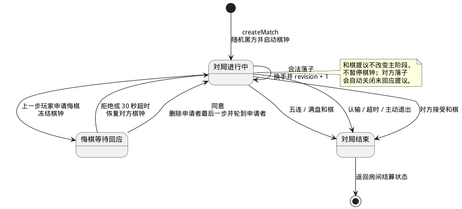
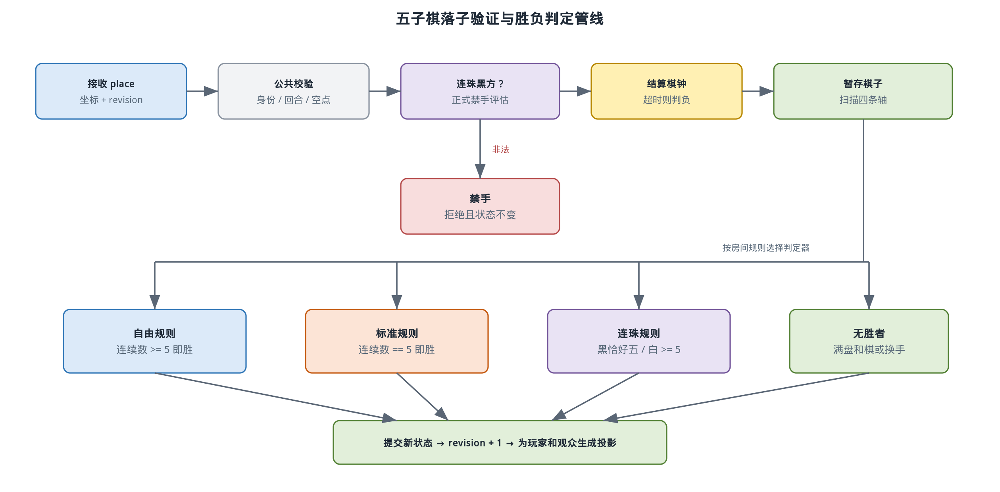

# 五子棋规则与实现设计

> 状态：实现基线
> 版本：1.0
> 依赖：[需求规格说明](../requirements.md)、[游戏插件扩展指南](../game-plugin-guide.md)

## 1. 目标与范围

五子棋是平台第一个端到端游戏，用来验证双人座位、服务端权威动作、计时、协商动作、AI、断线接管和再来一局。本文是五子棋玩家数、设置、动作、系统事件结果、AI 和胜负规则的唯一设计来源。首期固定使用 15x15 棋盘，提供自由规则、标准规则和连珠禁手三种预设，不实现连珠竞技开局。

游戏必须自动拒绝越界、重复落子、非当前玩家操作和禁手，并自动判断胜、负、和棋与超时。浏览器只提交落子坐标或协商意图，不能自行确认合法性或胜负。

## 2. 房间设置

| 设置       | 类型与默认值      | 约束                                       |
| ---------- | ----------------- | ------------------------------------------ |
| 规则       | `freestyle`，默认 | 可选 `freestyle`、`standard`、`renju`      |
| 计时       | 默认关闭          | 开启后总时间和单步时间分别配置             |
| 每方总时间 | 10 分钟           | 1～60 分钟                                 |
| 每步时间   | 60 秒             | 5～300 秒                                  |
| AI 难度    | 无                | AI 座位可选简单、普通、困难；连珠不允许 AI |

五子棋恰好需要两个参与座位。首局服务端安全随机决定黑方，后续每次再来一局交换黑白。任何设置变化都会清除双方准备状态。开局后不允许普通观众占据玩家座位或中途加入，只允许原断线玩家在恢复窗口内取回已有座位。

## 3. 棋盘与状态

棋盘坐标使用零基整数 `(x, y)`，`x` 从左向右、`y` 从上向下，合法范围都是 `0..14`。服务端状态使用一维定长数组或等价紧凑结构存储 225 个交叉点，空、黑、白分别用稳定枚举表示。

核心状态至少包含以下信息：

| 字段                   | 含义                                     |
| ---------------------- | ---------------------------------------- |
| `phase`                | `playing`、`undo_pending`、`ended`       |
| `board`                | 225 个交叉点的权威占用状态               |
| `turn`                 | 当前应行动的颜色                         |
| `colorBySeat`          | 座位与黑白颜色映射                       |
| `moves`                | 按顺序记录坐标、颜色、行动者和修订号     |
| `clockBySeat`          | 剩余总时间、当前步截止时间和暂停信息     |
| `pendingOffer`         | 当前悔棋或和棋请求及其过期时间           |
| `requestHistory`       | 防止同一局面重复申请悔棋的标记           |
| `winner` / `endReason` | 胜者与连五、认输、超时、退出、和棋等原因 |

下面的状态图强调普通落子、悔棋协商和结束状态之间的关系。和棋提议不暂停棋钟，因此不单独改变主阶段。

状态机的关键约束是：只有服务端能够从 `playing` 进入结束状态；悔棋挂起时冻结棋钟并禁止落子；结束后只允许房间级的重新准备，不再接受本局动作。

## 4. 落子处理流程

每个 `place(x, y)` 动作按以下固定顺序执行，任一步失败都保持原状态并返回稳定错误码：

1. 校验房间、对局和动作修订号。
2. 校验行动者占据当前颜色座位且连接具备控制权。
3. 校验当前没有悔棋请求，坐标在棋盘内且交叉点为空。
4. 连珠模式下，对黑方候选落子执行正式禁手判断。
5. 结算当前玩家本步与总时钟；若提交到达服务端时已经超时，则直接判负，不执行落子。
6. 暂存棋子，沿横、竖、主对角线、副对角线统计连续棋子并按规则判断胜利。
7. 未获胜且棋盘已满则判和；否则切换行动方并启动下一步时钟。
8. 递增游戏和房间修订号，向两个玩家及观众发送一致的公开投影。

下图把三种规则共用的落子管线和分支判定画在一起。禁手判断发生在提交状态之前，因此非法落子不会消耗棋钟之外的状态，也不会出现在动作历史中。

该管线使规则差异集中在 `RuleEvaluator`，房间、计时、广播和 AI 动作均复用同一个状态迁移入口。

## 5. 三种规则

### 5.1 自由规则

- 黑白双方规则相同。
- 任一方向形成连续五子或更多棋子立即获胜。
- 不存在三三、四四或长连禁手。

### 5.2 标准规则

- 黑白双方规则相同。
- 只有恰好连续五子获胜，六子及以上长连本身不构成胜利。
- 长连落子合法，对局在没有其他恰好五连时继续。

### 5.3 连珠禁手

- 黑方受到长连、双四和双活三禁手限制；白方没有禁手。
- 黑方长连始终是非法着手。
- 不形成长连时，黑方恰好五连优先作为胜着，不再以该着同时形成的双四或双活三判禁手。
- 未形成五连时，再判断该着是否同时产生两个或以上正式定义的“四”或“活三”。
- 黑方只能以恰好五连获胜，白方以五连或长连获胜。
- 禁手定义采用正式连珠规则，不使用仅按局部字符串数量计数的简化算法。

禁手检测器按四条穿过候选点的轴提取有限窗口，识别能在下一着形成合法五连的“四”，并通过合法延伸点验证“活三”。验证活三时必须递归排除延伸点本身是长连、双四或双三禁手的伪活三。实现需要设置明确的递归层级和缓存键，避免重复扫描，但不得用缓存改变正式规则语义。

服务端为当前局面计算黑方禁手集合，并把集合投影给所有玩家和观众。浏览器可以显示禁手标记，但落子合法性仍由服务端重新计算，不能信任客户端标记。

## 6. 计时

计时关闭时，状态不创建截止时间。计时开启时，总时钟和单步时钟同时生效：

- 当前方开始行动时记录服务端单调时间 `turnStartedAt`。
- 有效动作到达时，从当前方总时间扣除实际消耗，并检查单步上限。
- 总时间或单步时间任一耗尽，当前方立即超时判负。
- 客户端倒计时只是服务端截止时间的显示，不参与裁决。
- 动画播放期间服务端时钟不会暂停。

申请悔棋时先结算对方已经消耗的当前步时间，再冻结双方棋钟。请求被拒绝或 30 秒超时后，对方从被冻结的剩余步时间继续；请求获批后，申请者开始一个新的行动步时钟，但此前消耗的总时间不返还。

## 7. 悔棋、和棋与认输

### 7.1 悔棋

玩家只能撤销自己刚刚落下的最后一颗棋子，并且必须在对方落子前申请。服务端按以下规则处理：

1. 申请者必须是动作历史最后一步的行动者。
2. 当前局面修订号尚未出现过悔棋申请，同一步只能申请一次。
3. 请求发出后暂停棋钟并阻止双方落子，对方有 30 秒回应。
4. 拒绝或超时不改变棋盘，并恢复对方被冻结的时钟。
5. 同意后删除申请者最后一步，轮到申请者重新落子；已经消耗的总时间不返还。

AI 对手收到合法悔棋请求时默认同意，保证单人练习可纠正误操作。AI 自己不会主动申请悔棋。

### 7.2 和棋

当前玩家或非当前玩家都可以在未结束且没有其他协商请求时提议和棋。和棋请求不暂停计时；对方同意后立即以协商和棋结束，对方拒绝、完成落子或请求过期时自动关闭请求。每个局面每名玩家最多提议一次，避免重复干扰。

AI 默认拒绝和棋提议。棋盘填满且无人获胜时不需要协商，系统自动判和。

### 7.3 认输与退出

认输立即生效，对方获胜。玩家主动退出在局房间等价于认输，不进入 30 秒重连窗口。服务关闭以 `service_disabled` 终止，不计任何玩家胜负，也不保存战绩。

### 7.4 断线与重连系统事件

五子棋对平台连接事件作如下确定性响应：

| 系统事件                   | 插件行为                                                                           |
| -------------------------- | ---------------------------------------------------------------------------------- |
| `connection.lost`          | 计时继续，返回 `seat.useFallbackController`，由兜底控制器立即接管当前座位          |
| `connection.restored`      | 若比赛尚未结束，返回 `seat.returnHumanControl`；浏览器接收当前快照，兜底动作不回滚 |
| `connection.grace_expired` | 断线玩家立即判负，`endReason=disconnected`，本局结束且座位不可手动取回             |
| `member.left`              | 等价于认输，立即判负，不创建重连窗口                                               |

平台的恢复窗口固定为 30 秒。恢复只接受原登录会话；若兜底控制器在窗口内已经形成胜负，重连只显示结束局面，不再交回控制权。连珠规则虽然不开放房主可添加的 AI 座位，仍使用第 8 节定义的合法兜底控制器处理短暂断线。

## 8. AI 设计

房主可配置的五子棋 AI 只用于自由规则和标准规则，并通过与真人完全相同的 `place` 动作入口提交结果。AI 运行在 Worker Thread，主线程向它发送不可变棋盘快照、规则和时间预算；Worker 只返回候选坐标。

| 难度 | 时间上限 | 策略                                                 |
| ---- | -------- | ---------------------------------------------------- |
| 简单 | 100 ms   | 从合理候选中带权随机，优先立即获胜或阻止对方立即获胜 |
| 普通 | 500 ms   | 启发式评估、候选邻域裁剪和有限深度 alpha-beta        |
| 困难 | 2 s      | 迭代加深 alpha-beta、威胁排序、置换表和严格截止时间  |

困难 AI 每完成一层搜索就保存当前最佳合法落子；到达 2 秒硬截止时间时立即返回最近完成层的结果。候选生成优先考虑已有棋子两格范围内的位置，空棋盘使用中心点，避免对 225 个位置做无意义的全宽搜索。

连珠规则不允许房主添加 AI 座位，也不提供难度棋力。但为了满足平台的断线立即接管，连珠插件仍提供一个不展示为 AI profile 的兜底控制器：优先处理立即胜负，否则从服务端禁手评估器确认的合法候选中限时选择。该控制器只保证合法和及时，不承诺棋力。

评估函数至少区分己方和对方的活四、冲四、活三、眠三、活二，并把立即防守置于一般进攻分值之前。标准规则的长连不计为胜，需要在终局判断与评估中使用同一个规则评估器，避免 AI 选择服务端不认可的“获胜”点。

## 9. 浏览器交互

- 棋盘保持正方形并随可用区域缩放，在 1280x720 下仍完整显示玩家、计时和主要操作。
- 当前玩家把指针移到空位时显示落子预览；非法或非当前回合不显示可操作指针。
- 所有人都能看到连珠模式的黑方禁手标记。
- 最后一步使用明显但不遮挡棋子的标记；胜利时高亮构成胜利的五连或长连线段。
- 动画只包含短暂落子和胜利高亮，不阻塞下一条服务端消息。
- 操作区显示认输、和棋和符合条件时的悔棋按钮；协商请求使用明确的接受和拒绝控件。

## 10. 正确性验证

规则测试至少覆盖以下类别：

- 四个方向的边界落子、五连、长连和满盘和棋。
- 自由规则与标准规则对六连的不同结果。
- 连珠长连、双四、双活三、伪活三、五连优先和棋盘边缘形状。
- 非当前玩家、重复点、越界、过期修订号和结束后动作。
- 总时间、单步时间、悔棋冻结、拒绝恢复和 30 秒响应超时。
- 悔棋申请资格、重复申请、同意后的棋盘与回合恢复。
- AI 返回非法点、Worker 超时、不同难度时间上限和确定的紧急攻防局面。
- `connection.lost` 临时接管、30 秒内恢复、`connection.grace_expired` 判负、主动退出和服务关闭。

## 11. 实现文件边界

当前实现按共享合同、服务端规则、自动化决策和浏览器交互分层：

| 当前路径                        | 职责                                                                     |
| ------------------------------- | ------------------------------------------------------------------------ |
| `games/gomoku/shared`           | manifest、设置、动作、状态投影和展示事件 schema                          |
| `games/gomoku/server/rules`     | 棋盘查询、三种规则、胜负与禁手评估                                       |
| `games/gomoku/server/engine.ts` | 动作、协商、计时、系统事件和投影的权威状态机                             |
| `games/gomoku/server/ai`        | AI 输入投影、候选生成、搜索、评估和三档 profile；Worker 由平台执行器承载 |
| `games/gomoku/server/module.ts` | 服务端插件组合入口与开局约束                                             |
| `games/gomoku/web`              | 设置编辑器、棋盘、计时、协商操作和结果展示                               |
| `games/gomoku/tests`            | 规则、状态机、计时和 AI 测试                                             |

模块边界确保规则评估器同时服务于真人动作、AI 搜索和客户端禁手投影，避免出现三套不同规则实现。
