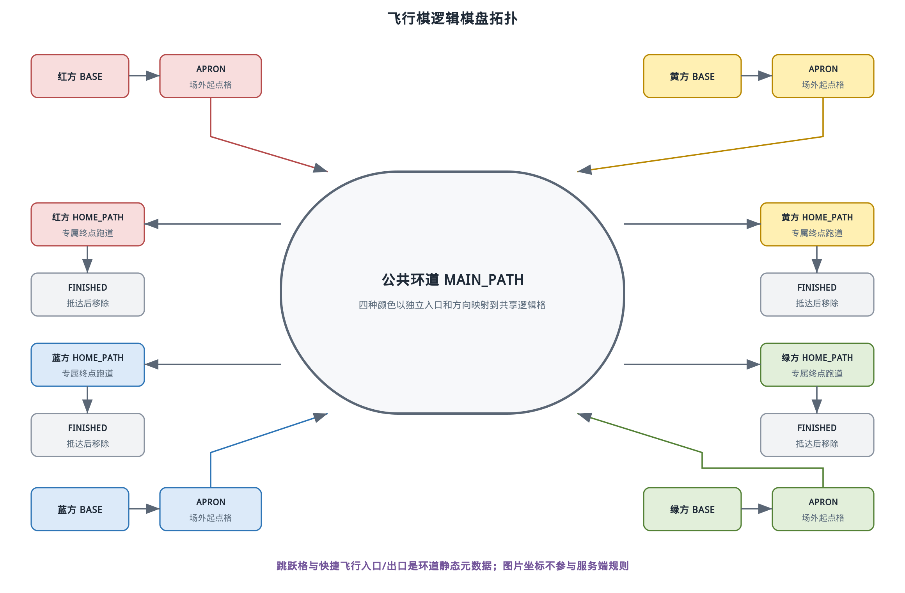
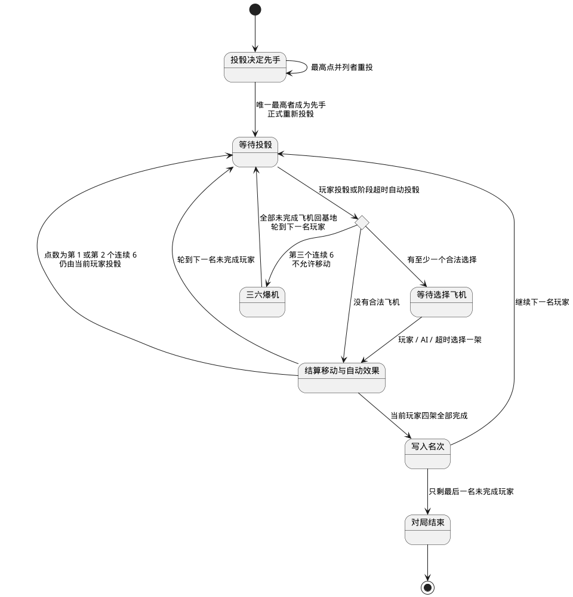
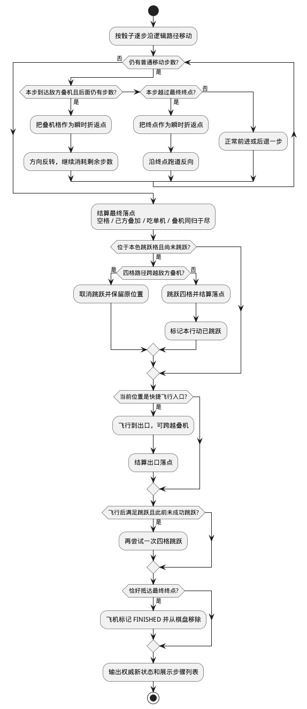

# 飞行棋规则与实现设计

> 状态：实现基线
> 版本：1.0
> 依赖：[需求规格说明](../requirements.md)、[游戏插件扩展指南](../game-plugin-guide.md)

## 1. 目标与规则基线

首期飞行棋采用中国常见十字四色棋盘，支持 2～4 个参与者，每种颜色四架飞机。本文是飞行棋玩家数、设置、动作、系统事件结果、AI、排名和胜负规则的唯一设计来源。参与者可以是真人或 AI，但至少需要一名真人。游戏实现完整的起飞、连续投骰、三六爆机、叠机阻挡、吃子、同色跳跃、快捷飞行、终点反弹和依次排名。

飞行棋用于验证平台对多人座位、随机数、多阶段回合、连续行动、自动超时动作、AI 填充和退出后 AI 接管的支持。所有骰子和移动均由服务端裁决，浏览器动画只呈现已经确认的结果。

### 1.1 房间设置

首期只提供一套本文定义的固定规则，不提供组队或房规开关。房主可以配置每个投骰/选飞机阶段的行动时间，默认 30 秒，允许范围为 10～120 秒；阶段计时不能关闭，以保证退出或无人操作时多人对局仍能继续。AI 按座位添加或移除，不属于规则设置字段。

## 2. 棋盘拓扑

游戏不把路线规则硬编码成图片坐标，而是把逻辑拓扑与视觉布局分离。每种颜色拥有以下区域：

首期棋盘使用 15×15 网格，四个基地的背景各占 3×3 格，四架飞机在其中按紧凑的 2×2 阵列对称排列。棋盘外围按顺时针编号为 56 个物理位置，其中 52 个是可行走的公共环道格，位置 5、19、33、47 是填充转角的灰色不可走格。外围的上、右、下、左四条侧边各有 7 个环道格；飞机经过侧边交界时跳过灰色转向格，不把它计入行动步数。每种颜色在公共环道上行走 50 格后进入自己的 6 格终点跑道，终点跑道最后一格为到达后移除飞机的终点。

物理编号从红色起点之后的第一格开始，按顺时针排列如下（括号内为特殊含义）：

`1 蓝，2 红，3 黄，4 绿，5 灰（转向），6 蓝（飞行格），7 红，8 黄，9 绿（转向），10 蓝，11 红，12 黄（进入终点段），13 绿，14 蓝，15 红（转向），16 黄，17 绿，18 蓝，19 灰（转向），20 红（飞行格），21 黄，22 绿，23 蓝（转向），24 红，25 黄，26 绿（进入终点段），27 蓝，28 红，29 黄（转向），30 绿，31 蓝，32 红，33 灰（转向），34 黄（飞行格），35 绿，36 蓝，37 红（转向），38 黄，39 绿，40 蓝（进入终点段），41 红，42 黄，43 绿（转向），44 蓝，45 红，46 黄，47 灰（转向），48 绿（飞行格），49 蓝，50 红，51 黄（转向），52 绿，53 蓝，54 红（进入终点段），55 黄，56 绿，随后回到 1 蓝。`

四个快捷飞行入口是物理位置 6、20、34、48；四个颜色进入终点段的位置是 12、26、40、54。灰色位置只用于视觉上的转向填充，不能停留、碰撞或作为飞行目标。四条飞行路线分别穿过对面颜色进入终点跑道后的第 3 格：红线穿过绿方、黄线穿过蓝方、绿线穿过红方、蓝线穿过黄方。

| 区域                 | 含义                             | 是否与其他颜色共享 |
| -------------------- | -------------------------------- | ------------------ |
| 基地 `BASE`          | 尚未起飞或受罚返回的飞机         | 否                 |
| 起点格 `APRON`       | 掷出 5 或 6 后放置飞机的场外格   | 否                 |
| 公共环道 `MAIN_PATH` | 起点格之后进入的十字棋盘公共路线 | 是                 |
| 终点跑道 `HOME_PATH` | 本色飞机完成公共环道后的专属路线 | 否                 |
| 完成 `FINISHED`      | 抵达最终终点后从棋盘移除         | 不适用             |

用户特别指定起点格不属于公共棋盘：起飞动作只把飞机从基地移到本色起点格，不继续移动；起点格位于基地外沿，并与出发后进入的第一格正交相邻。飞机在后续一次投骰移动时，第一步才进入公共环道。公共环道的第一个进入格是上家颜色格，第二个格才是该颜色的本色跳跃格；例如红机在红色场外起点格掷出 `2` 后，依次经过蓝色的 `main-0` 和红色的 `main-1`，再按同色跳跃规则结算。每个颜色的 `mainPath`、`homePath`、同色跳跃格和快捷飞行入口、穿越格、出口都由静态棋盘定义数据描述，渲染层只负责把逻辑格映射到屏幕坐标。

以红色为例，飞机起飞后先位于红色场外起点格；后续行动的第一步进入物理位置 1 蓝，连续行动四步到达第一侧的最后一格（位置 4 绿），再行动一步跳过位置 5 的灰色转向格，落到物理位置 6 蓝。位置 6 是上家颜色的快捷飞行入口，因此这一步正好进入上家的飞行起点格。

下图展示逻辑拓扑而不是具体美术棋盘。四种颜色共享环道，但基地、场外起点格和终点跑道彼此隔离。

这种表示避免规则依赖某一张棋盘图片的像素位置，也使移动算法可以使用路径索引测试。

## 3. 玩家、座位与开局

- 四个座位分别对应红、黄、蓝、绿，开局前由玩家自由选择未占用颜色。
- 房主不能替其他玩家调整颜色，但可以向空座添加 AI，或在开局前移除 AI。
- 真人可以在开局前占据 AI 座位并替换 AI；开局后座位和颜色固定。
- 参与者总数为 2～4，且至少一名真人。每名参与者控制四架飞机。
- 所有人准备后，房主开始游戏。
- 开局后不允许普通观众占据空位或替换 AI；只有原断线账号可以按第 10.1 节取回自己的接管座位。

开局时每名参与者各投一次骰子，最高点数者先手；最高点数并列者单独重投，直到唯一最高者产生。决定顺序的骰子不用于移动，先手随后重新投骰开始正式回合，之后按棋盘颜色的顺时针座位顺序轮转，跳过空座和已经完成排名的座位。

## 4. 核心状态

| 字段             | 含义                                                                      |
| ---------------- | ------------------------------------------------------------------------- |
| `phase`          | `deciding_order`、`waiting_roll`、`selecting_plane`、`resolving`、`ended` |
| `seatOrder`      | 本局顺时针有效座位及首位玩家                                              |
| `currentSeat`    | 当前执行回合的座位                                                        |
| `sixStreak`      | 当前玩家在同一回合连续掷出 6 的次数                                       |
| `roll`           | 当前服务端骰子结果；选飞机前公开                                          |
| `planes`         | 每架飞机的颜色、编号、区域和路径索引                                      |
| `rankings`       | 已完成玩家的有序名次                                                      |
| `actionDeadline` | 当前投骰或选择飞机阶段的截止时间                                          |
| `controller`     | 每个真人座位当前由用户、临时 AI 或接管 AI 控制                            |
| `rngState`       | 服务端随机源上下文，不投影给客户端                                        |

下面的状态图给出一个正式回合的阶段变化。掷出 6 会在动作完成后回到同一玩家的投骰阶段，第三个连续 6 则直接执行爆机处罚。

阶段拆分保证“投骰”和“选飞机”是两个不同的可超时动作。服务端不会接受尚未投骰时的飞机选择，也不会在已经选定后接受第二次选择。

## 5. 投骰、起飞与连续回合

### 5.1 服务端随机

骰子使用服务端安全随机源独立生成 `1..6` 的整数。首期不实现随机承诺、种子公开或赛后验证，也不提前生成后续点数。AI 和客户端只能看到已经掷出的当前点数。

### 5.2 起飞

- 掷出 5 或 6 时，可以选择把一架基地飞机移动到本色场外起点格。
- 如果同时存在已起飞飞机，玩家可以自由选择起飞或移动其中一架在途飞机。
- 起飞消耗当前完整骰子结果，不在同一次动作中继续走 5 或 6 格。
- 场外起点格只属于本色，可以容纳多架己方飞机，不与敌方发生碰撞。
- 掷出 5 并起飞后正常结束回合；掷出 6 并起飞后仍获得额外投骰。

### 5.3 连续投骰与三六爆机

同一玩家在一个回合内掷出 6 后，完成当前动作并再次投骰。`sixStreak` 只跨越本玩家因 6 获得的连续动作，不跨越其他玩家回合。

第三次连续掷出 6 时不允许选择或移动飞机，立即执行三六爆机：该玩家所有位于场外起点格、公共环道和终点跑道的飞机全部返回基地；已经在基地或已经完成并移除的飞机不受影响。处罚不触发吃子、跳跃、飞行或落点效果，随后清零连续 6 计数并轮到下一名玩家。

## 6. 普通移动与反弹

玩家选择一架非基地飞机后，服务端按骰子点数逐步沿该颜色的逻辑路径移动。逐步执行而不是直接做索引加法，是为了正确处理敌方叠机和终点的反弹。

### 6.1 敌方叠机反弹

两架或更多同色敌机位于同一公共环道格时形成阻挡。己方飞机和快捷飞行不受此阻挡。

普通移动遇到敌方叠机时采用用户指定的“走到阻挡点再原路返回”算法：

1. 如果叠机位于最后一步的落点，飞机正常落在该格并执行同归于尽。
2. 如果到达叠机格后仍有剩余步数，飞机把该格作为瞬时折返点，不发生碰撞。
3. 移动方向反转，使用全部剩余步数沿刚才路径原路返回。
4. 反向路径再遇到另一个敌方叠机或终点边界时，按同样规则再次反弹。
5. 所有骰子步数耗尽后，才把最终位置提交为落点并处理落点效果。

例如飞机距敌方叠机 3 格，骰子为 5：前三步到达叠机所在格，剩余两步沿原路反向，最终停在叠机前方第二格。中间到达叠机格不是最终落点，所以双方都不返回基地。

### 6.2 终点反弹

飞机进入本色终点跑道后，如果点数超过最终终点，则把最终终点作为瞬时折返点，使用剩余步数沿终点跑道倒退。最终终点只在恰好耗尽最后一步时完成；完成飞机立即从棋盘移除。

终点跑道不存在敌方飞机。己方飞机可以共用格子但每次只移动其中一架；最终落点的自动效果只在公共环道上判断。

## 7. 落点、叠机与吃子

普通移动、跳跃或飞行完成后，按最终落点统一结算：

- 空格：移动飞机保留在该格。
- 己方飞机：允许叠加，形成或扩大己方叠机；叠机不能一起移动。
- 敌方单机：敌机返回基地，移动飞机留在落点。
- 敌方叠机：移动飞机和落点内全部敌机同归于尽，全部返回各自基地。

己方叠机不会阻挡己方飞机，己方飞机可以正常越过或落入。敌方叠机只有在公共环道上形成阻挡；基地、场外起点格和终点跑道是各颜色私有区域，但快捷飞行经过敌方终点跑道指定穿越格时会执行第 8 节定义的一次临时碰撞判定。

## 8. 跳跃与快捷飞行

自动移动使用以下顺序，并保证一次行动最多成功跳跃一次：

1. 完成骰子普通移动或反弹，得到第一个最终落点。
2. 如果落在本色跳跃格且本行动尚未成功跳跃，尝试沿公共路径向前跳四格。
3. 跳跃的中间路径若会跨越敌方叠机，则取消整个跳跃，飞机留在跳跃前的格子；不会改为反弹。
4. 跳跃终点恰好是敌方叠机时不算“跨越”，正常执行同归于尽。
5. 如果当前落点是本色快捷飞行入口，则先沿固定路线飞到对面颜色终点跑道的第 3 格。
6. 穿越格为空时继续飞行；有一架敌机时将敌机送回基地后继续飞行；有两架或更多敌机叠机时，飞行棋与该格全部敌机同归于尽并终止本次飞行。
7. 飞行棋在穿越格存活时继续飞到本色出口，并按普通落点规则处理出口内的敌方单机或叠机。
8. 飞行结束后，如果此前没有成功跳跃且出口满足跳跃条件，可以再跳跃一次。
9. 已经成功跳跃后即使飞行出口仍满足条件，也不再进行第二次跳跃。

跳跃因阻挡被取消时不计为“成功跳跃”；如果当前位置随后触发快捷飞行，飞行结束后仍可能执行一次合法跳跃。自动效果链最多包含一次跳跃和一次飞行，防止棋盘配置错误形成循环。客户端把一次完整飞行播放为“入口到穿越格”和“穿越格到出口”两个 `fly` 步骤；叠机同归于尽时只有第一段。

下图把普通移动、反弹、落点碰撞、跳跃和飞行合并成确定性结算流程。客户端只播放服务端返回的步骤列表，不在本地重复推导路径。

步骤列表同时用于短动画和规则测试，例如 `move`、`bounce`、`capture`、`jump_cancelled`、`jump`、`fly`、`finish`。这些步骤是已确认状态迁移的展示事件，不是客户端可以单独提交的动作。

## 9. 回合结束与排名

一次飞机动作及全部自动效果结束后：

- 当前骰子不是 6 时，清零连续 6 计数并轮到下一名未完成玩家。
- 当前骰子是第一或第二个连续 6 时，同一玩家再次进入投骰阶段。
- 第三个连续 6 已在选择飞机前处罚并结束回合。
- 玩家四架飞机全部完成后立即写入下一个名次，退出后续回合并转为观战状态，但可以继续聊天。
- 只剩一名未完成玩家时，系统直接把该玩家记为最后一名并结束对局。

结束结果只在当前房间内展示，不写入历史战绩。再来一局保留房间成员，但所有颜色需要重新准备并允许重新选择。

## 10. 超时与 AI

飞行棋只使用阶段计时，不使用玩家整局总时钟。默认每个投骰阶段和选飞机阶段都是 30 秒：

- 投骰超时由服务端自动投骰。
- 选飞机超时从当前合法飞机中安全随机选择一架。
- 没有合法飞机时直接结束当前动作；如果骰子是 6，仍计入连续 6 并进入相应的额外投骰或爆机流程。

普通 AI 与超时选择不同。普通 AI 使用以下优先级评分，并在同分候选中随机选择：

普通飞行棋 AI 在提交每次投骰或选飞机动作前固定等待 0.5 秒，用于给玩家留下清晰的回合反馈；断线或超时使用的兜底控制器不受这段等待影响。

1. 恰好完成飞机。
2. 吃掉敌机且避免同归于尽。
3. 获得快捷飞行或成功跳跃。
4. 让基地飞机起飞。
5. 推进更接近终点的飞机。
6. 降低在敌方高风险落点停留的概率。

AI 只接收当前骰子、公开棋盘和自己的合法候选，不读取未来随机数。

### 10.1 连接、退出与座位取回

飞行棋对平台连接和成员系统事件作如下响应：

| 系统事件或命令             | 插件行为                                                                                                          |
| -------------------------- | ----------------------------------------------------------------------------------------------------------------- |
| `connection.lost`          | 阶段计时继续，返回 `seat.useFallbackController`，AI 立即临时接管                                                  |
| `connection.restored`      | 30 秒窗口内返回 `seat.returnHumanControl`；发送当前快照，不回滚 AI 已完成动作                                     |
| `connection.grace_expired` | 临时 AI 转为持续 AI，保留原 `ownerAccountId` 并返回 `seat.setReclaimable(true)`                                   |
| `seat.reclaim_requested`   | 由原账号的 `room.seat.reclaim` 命令触发；校验通过后返回 `seat.returnHumanControl` 和 `seat.setReclaimable(false)` |
| `member.left`              | 不使用恢复窗口，立即由持续 AI 接管；若已无任何真人，房间按平台规则销毁                                            |

窗口到期后，其他账号不能占据保留座位。原账号以后可以从未控制其他房间的登录设备重新进入观战位并手动取回。取回只影响后续动作，AI 已完成的投骰、移动、碰撞、排名和其他状态变化均不回滚。

## 11. 浏览器交互

- 棋盘按十字形完整显示，四个玩家区固定对应颜色和方位。
- 当前阶段明确显示“投骰”或可选飞机；不可选飞机降低视觉权重。
- 骰子动画短暂播放，但服务端结果在动画前已经确定，不能通过刷新重投。
- 棋盘以本色细虚线标出四条快捷飞行路线，并在敌方终点跑道的穿越格显示交点。
- 移动按服务端步骤列表依次播放，并对反弹、跳跃取消、飞行、吃子和三六爆机使用不同但简短的反馈。
- 快速连续掷出 6 时，客户端可以排队播放动画，但不能延迟服务端行动截止时间。
- 已完成玩家显示名次并切换为观战状态。

## 12. 正确性验证

规则测试至少覆盖：

- 2、3、4 人座位、颜色选择、初始投骰并列和顺时针轮转。
- 掷出 5 或 6 起飞、场外起点格、6 的额外投骰和连续计数清零。
- 第三个连续 6 立即爆机，覆盖公共环道、起点格、终点跑道和已完成飞机。
- 敌方单机、己方叠机、敌方叠机的落点结果。
- 普通移动跨叠机反弹、恰好落在叠机、反向再遇阻挡和多次反弹。
- 终点恰好到达、超出反弹和倒退最终位置。
- 跳跃成功、跨叠机取消、终点叠机同归于尽以及一次行动最多一次跳跃。
- 飞行穿越格为空、吃掉单机后继续、与叠机同归于尽、出口碰撞，以及飞行后允许或禁止跳跃的两种路径。
- 投骰超时、选飞机超时、无合法飞机和超时掷出 6。
- AI 合法性、主动退出接管、断线临时接管、窗口到期持续接管、原账号手动取回和完成排名。

## 13. 实现文件边界

当前实现将逻辑拓扑、权威移动结算和浏览器坐标保持为独立层：

| 当前路径                      | 职责                                                     |
| ----------------------------- | -------------------------------------------------------- |
| `games/ludo/shared`           | manifest、设置、动作、投影视图、展示步骤和浏览器棋盘坐标 |
| `games/ludo/server/board`     | 逻辑路径、跳跃、飞行和格子查询                           |
| `games/ludo/server/rules`     | 开局顺序、回合、反弹、碰撞、爆机和排名                   |
| `games/ludo/server/ai`        | 自动化输入、合法候选与规则型评分                         |
| `games/ludo/server/module.ts` | 服务端插件组合入口、系统事件和投影                       |
| `games/ludo/web/index.tsx`    | 十字棋盘、骰子、飞机、操作和短动画                       |
| `games/ludo/tests`            | 拓扑、移动管线、状态机、超时和 AI 测试                   |

棋盘数据、移动规则和浏览器坐标必须分离。服务端输出逻辑步骤，浏览器只把步骤映射成动画，从而避免视觉实现成为第二套规则引擎。
