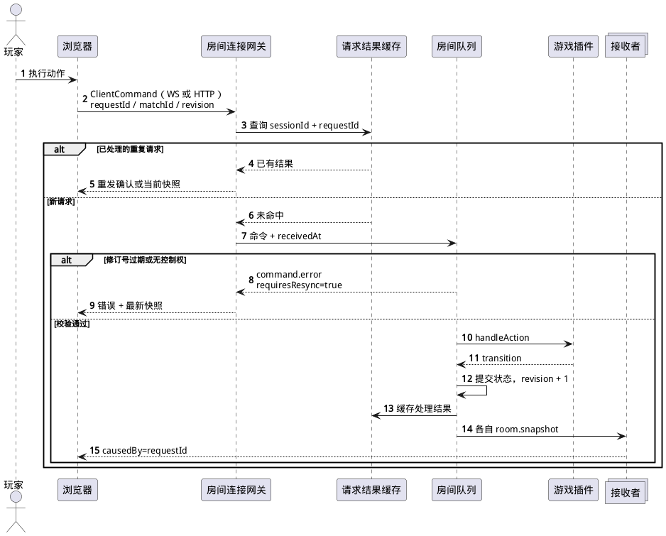
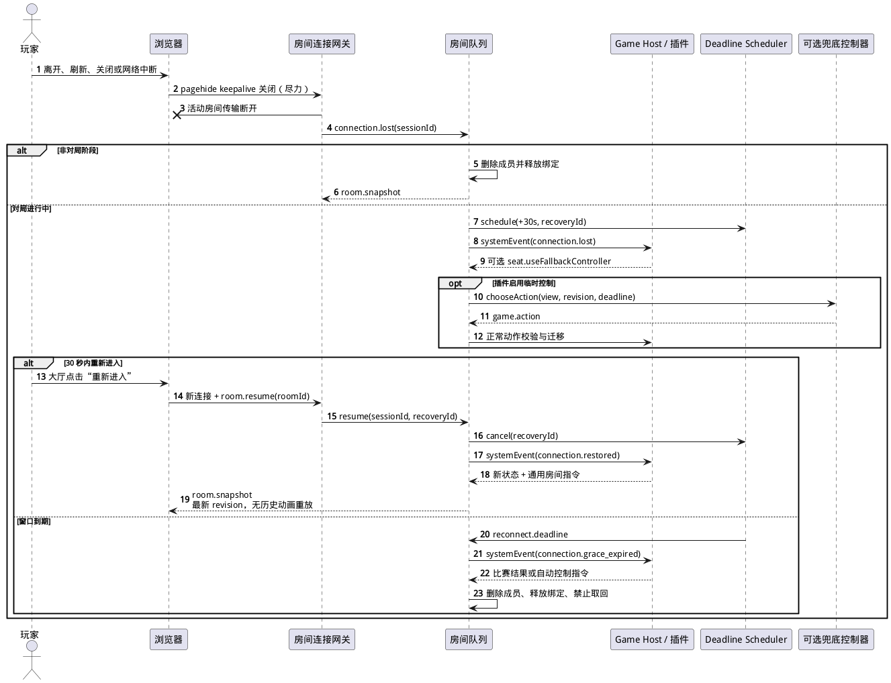

# Tabletop HTTP 与实时协议设计

> 状态：已实现的协议 v1 基线
> 协议版本：v1
> 传输：HTTP/JSON + WebSocket/JSON（HTTP 长轮询后备）

## 1. 设计原则

协议负责可靠地表达账号、房间和游戏意图，不泄漏游戏内部状态。首期使用 JSON，原因是消息规模小、调试直接、TypeScript 校验方便；未来如有高频实时游戏，可以在新协议版本中为特定载荷增加二进制编码。

关键原则如下：

- HTTP 处理资源与管理操作；房间连接优先使用 WebSocket，在浏览器或网络禁用 WebSocket 时使用共享协议的 HTTP 长轮询后备。
- 会话身份来自 Cookie，不允许客户端声明账号或角色。
- 每条写命令有唯一 `requestId`，每个房间状态有单调递增 `revision`。
- 服务端成功处理后返回带 `stateChanged` 的确认；状态变化时再发送按接收者投影的完整快照，展示事件只辅助动画。
- 刷新或重连不补发所有历史动作，直接用最新快照恢复。
- 密码和邀请令牌先换取短期 join ticket，不直接进入游戏动作协议。

## 2. HTTP 通用约定

所有 API 使用 `/api/v1` 前缀和 UTF-8 JSON。成功响应返回明确资源，失败响应使用统一结构：

```json
{
  "error": {
    "code": "AUTH_INVALID_CREDENTIALS",
    "message": "用户名或密码错误",
    "requestId": "01J...",
    "details": {}
  }
}
```

`code` 是客户端分支依据，`message` 是可展示的中文默认文案，`details` 只包含安全公开的字段错误。服务端异常栈和数据库信息不得进入响应。

服务端为每个 HTTP 请求生成 ULID，并通过响应头 `X-Request-Id` 返回以关联日志。带 JSON 请求体的接口使用 `Content-Type: application/json`，Fastify 请求体上限为 64 KiB；返回 `204` 的无体接口不要求伪造空 JSON。

认证使用 `tt_session` HttpOnly Cookie。除登录外的认证写接口同时校验同源 Origin、非 HttpOnly `tt_csrf` Cookie 与 `X-CSRF-Token` 请求头；Cookie 和请求头必须相同，并与当前会话保存的哈希匹配。认证会话、目录、列表、后台读取和审计导出等响应设置 `Cache-Control: no-store`，客户端也不得缓存账号或服务状态。

## 3. 认证与会话 API

| 方法与路径 | 身份 | 用途 |
| --- | --- | --- |
| `POST /api/v1/auth/login` | 匿名 | 用户名、密码登录并创建设备会话 |
| `POST /api/v1/auth/logout` | 登录 | 撤销当前会话并清除 Cookie |
| `GET /api/v1/auth/session` | 登录 | 返回当前账号、角色、会话过期时间 |
| `POST /api/v1/auth/change-password` | 登录 | 校验当前密码并修改，撤销其他会话 |

登录成功设置随机会话 Cookie。Cookie 原值只保存在浏览器，SQLite 保存由 `SESSION_SECRET` 参与计算的 HMAC-SHA-256 摘要；每次请求计算摘要后查找有效会话。CSRF 摘要使用同一密钥，轮换密钥会使全部旧会话和 CSRF 值失效。会话滑动续期在距离 `last_seen_at` 满 24 小时后才写入一次，并把 `expiresAt` 延长到当前时间后的 30 天，避免每个 HTTP 请求写数据库。

登录错误统一返回相同文案，不暴露用户名是否存在。限流同时考虑来源 IP 和规范化用户名；成功登录不会把失败计数写入审计以外的长期用户数据。

## 4. 游戏和房间 HTTP API

| 方法与路径 | 用途 |
| --- | --- |
| `GET /api/v1/games` | 返回编译注册游戏、manifest 摘要、公开 `botProfiles` 和启停状态 |
| `GET /api/v1/rooms` | 返回公开房间摘要，支持 `gameId`、状态和可加入性筛选 |
| `POST /api/v1/rooms` | 创建房间，校验游戏启用、名称、密码和游戏设置 |
| `POST /api/v1/rooms/:roomId/join-ticket` | 从房间列表进入；校验可选密码并签发 ticket |
| `POST /api/v1/invites/:inviteToken/join-ticket` | 从邀请链接进入；绕过房间密码并签发 ticket |

房间创建响应同时返回 `roomId`、邀请链接和创建者的短期 join ticket。普通房间进入 ticket 默认 30 秒过期、单次使用，并绑定 `sessionId`、`roomId` 和进入来源。创建者从未连接且 ticket 到期时，平台通过房间队列移除该成员：除空座 `soloPractice` 练习房特例外，没有其他 `connected` 或 `reconnecting` 成员时销毁，仍有活动或等待恢复的访客时转移房主并保留；声明 `soloPractice` 能力的练习房在该操作使全部座位变空时直接销毁，不由观众连接保活。ticket 只用于建立房间成员身份，不能替代登录会话。

邀请令牌使用至少 128 位不可预测随机值。邀请 URL 泄露等价于绕过房间密码，但访问者仍必须登录；房间销毁后令牌失效。

游戏目录中的每个 `botProfiles` 项包含 `profileId`、`displayName`、`description` 和服务端硬预算 `timeBudgetMs`。该数组只描述房主可添加的 AI；断线/超时兜底控制器不进入目录。没有可配置 AI 的游戏返回空数组。

当前请求与响应的关键字段如下：

- `POST /api/v1/rooms` 接收 `gameId`、1～30 字符的 `name`、可选 `password`、插件 `settings`、默认 `false` 的 `practice`，以及仅供练习房使用的可选 `botProfileId`；响应返回 `roomId`、`inviteUrl`、`joinTicket` 与 `joinTicketExpiresAt`，并显式设置 `Cache-Control: no-store`。
- `GET /api/v1/rooms` 可按 `gameId`、`status` 和 `joinable` 查询；摘要包含房主名、已占座位数、最大玩家数、观众数、观众上限、状态、密码标记和可加入标记。
- 房间列表 join-ticket API 接收可选 `password` 或空对象；邀请 join-ticket API 不需要业务请求体。两者统一返回 `roomId`、`joinTicket` 和 `expiresAt`。

## 5. 管理 API

| 方法与路径 | 用途 |
| --- | --- |
| `GET /api/v1/admin/accounts` | 分页、筛选普通账号 |
| `POST /api/v1/admin/accounts` | 创建账号并设置初始密码 |
| `PATCH /api/v1/admin/accounts/:accountId` | 启用或禁用账号 |
| `POST /api/v1/admin/accounts/:accountId/reset-password` | 设置新密码并撤销全部会话 |
| `DELETE /api/v1/admin/accounts/:accountId` | 仅在账号离线且不属于任何房间时删除 |
| `GET /api/v1/admin/services` | 读取全站及各游戏启停状态 |
| `PUT /api/v1/admin/services/site` | 立即开启或关闭全站 |
| `PUT /api/v1/admin/services/games/:gameId` | 立即开启或关闭单游戏 |
| `GET /api/v1/admin/audit` | 按时间、账号和操作筛选审计日志 |
| `GET /api/v1/admin/audit.csv` | 导出当前筛选条件对应的 CSV |

管理 API 不提供房间列表、房间详情、对局状态或强制房间操作。关闭服务由内部服务管理器遍历并终止受影响房间，这一内部行为不会暴露成通用房间后台。

所有管理写接口需要管理员角色与 CSRF 防护，并在同一数据库事务中写入操作结果和审计记录。导出 CSV 时对以 `= + - @` 开头的文本做转义，避免电子表格公式注入。

## 6. 房间连接与传输

客户端优先使用当前站点的 `/ws?protocol=1` 建立 WebSocket，浏览器自动携带会话 Cookie。服务端按以下顺序处理：

1. 校验 Origin、协议版本、会话和全站状态。
2. 分配 `connectionId`，加载 `accountId` 与 `sessionId`。
3. 发送 `connection.ready`，包含服务端 UTC 时间和应用层心跳参数。
4. 客户端使用 join ticket 提交 `room.join`，或在重连时提交原房间恢复信息。
5. 服务端建立成员绑定后发送完整 `room.snapshot`。

每个 `connectionId` 最多绑定一个房间。同一 `sessionId` 可以为多个不同房间分别建立 WebSocket 或长轮询连接，成员恢复绑定按 `sessionId + roomId` 区分；新建一个房间连接不会接管该会话在其他房间的连接。若旧连接处于网络半开状态，同一 `sessionId + roomId` 的新连接发送 `room.resume` 后可以直接替换旧 `connectionId`，网关按 ID 精确关闭被替换的连接，不会误关正在排队恢复的其他新连接。

升级握手后，每个客户端帧先经过不解析载荷的连接级总限流，再解析最小 JSON 信封以选择普通命令或临时事件子限流通道，随后重新验证会话并执行完整 Zod 与房间命令处理；心跳也会周期重验会话。二进制、损坏 JSON 和超限帧不会绕过第一层保护。这样注销、改密、管理员重置或自然过期会关闭已有连接，同时超限帧不会先触发数据库查询。

若 WebSocket 构造或握手失败，或者建立后 10 秒内仍未收到首个房间快照，浏览器自动切换到同源 HTTP 长轮询。已经成功收到过快照的 WebSocket 断开时，客户端先尝试恢复 WebSocket；新连接仍无法取得快照时再切换长轮询。长轮询本身建连或运行失败后会重新探测 WebSocket，避免一次偶发故障把页面永久固定在不可用的传输上。重试采用带随机抖动、上限 8 秒的递增间隔；浏览器的传输恢复预算覆盖服务端识别半开连接所需的心跳周期和随后 30 秒业务窗口，但是否仍有房间恢复资格始终以服务端答复为准。这个选择只改变传输，不改变 `connectionId`、命令信封、请求去重、房间绑定、快照或重连语义。

长轮询使用以下认证写接口，全部要求当前会话、同源 Origin、CSRF Cookie 与请求头：

| 方法与路径 | 用途 |
| --- | --- |
| `POST /api/v1/room-connections` | 创建连接；请求 `{ "protocol": 1 }`，响应含 `connectionId` 和首条 `connection.ready` |
| `POST /api/v1/room-connections/:connectionId/poll` | 等待服务端消息；单次最多挂起 15 秒，返回消息数组和可选关闭原因 |
| `POST /api/v1/room-connections/:connectionId/commands` | 提交与 WebSocket 完全相同的 `ClientCommand`；`202` 只表示网关接收，业务结果仍由消息返回 |
| `DELETE /api/v1/room-connections/:connectionId` | 页面离开时主动关闭连接 |

同一长轮询连接只允许一个等待中的 poll，请求或命令会刷新 45 秒连接租约；同一会话可以为不同房间同时维护多条长轮询连接。浏览器把建连和权威命令限制为 10 秒，把单次 poll 限制为 25 秒；后者高于服务端正常的 15 秒等待，既允许合理网络延迟，也能识别被代理或网络栈永久挂起的请求。服务端出站队列最多保留 128 条消息；没有 `causedBy` 的同房间完整快照可以被更新版本替换，同一座位排队中的 `game.transient` 只保留最新值并维持其实际发送顺序。临时事件在队列满时直接丢弃；确认、错误、快照等权威消息会先淘汰一条排队中的临时事件，只有队列全部为不可丢弃消息时才关闭慢连接。租约到期同样会进入正常的 30 秒房间重连流程。

WebSocket 使用两层心跳：服务端每 20 秒发送协议控制帧 ping，10 秒内没有 pong 则关闭连接；浏览器在 20 秒没有应用消息时发送 `connection.ping`，10 秒内没有收到对应 `connection.pong` 就主动放弃半开 WebSocket 并改用长轮询。浏览器从离线恢复或页面重新可见时会立即重新检查连接。当前房间页面为该页面生命周期建立一条活动房间连接；离开页面会关闭连接，重新进入或网络中断后创建新连接。

## 7. 消息信封

客户端命令使用以下通用信封：

```ts
interface ClientCommand<TPayload> {
  protocol: 1;
  requestId: string;
  type: string;
  roomId?: string;
  matchId?: string;
  expectedRevision?: number;
  payload: TPayload;
}
```

`requestId` 使用 UUID 或 ULID，在一次权威用户意图的重试中保持不变。权威 `game.action` 必须带 `roomId`、`matchId` 和 `expectedRevision`；不改变状态的 `game.transient` 带 `roomId` 与 `matchId`，但不带 `expectedRevision`。纯连接或首次进房命令可以省略相应字段。

服务端事件使用对称信封：

```ts
interface ServerMessage<TPayload> {
  protocol: 1;
  messageId: string;
  type: string;
  roomId?: string;
  matchId?: string;
  revision?: number;
  causedBy?: string;
  serverTime: string;
  payload: TPayload;
}
```

`causedBy` 指向客户端 `requestId`，便于客户端关联响应或结束提交状态。当前 `connection.pong`、`command.ack` 和 `command.error` 必须携带该字段，`room.snapshot` 可以省略；没有客户端来源的计时、AI 和服务关闭消息不设置该字段。

## 8. 客户端命令

### 8.1 连接与通用房间命令

| 类型 | 主要载荷 | 说明 |
| --- | --- | --- |
| `connection.ping` | 空 | WebSocket 应用层存活探测，不绑定房间、不进入权威命令待处理队列 |
| `room.join` | `joinTicket` | 首次建立房间成员身份，普通加入默认为观众 |
| `room.resume` | `roomId` | 按 `sessionId + roomId` 在 30 秒窗口内恢复、接管尚未被判定断开的旧连接，或完成该房间已预绑定但从未 attach 的首次连接 |
| `room.leave` | 空 | 主动离开，不进入重连窗口 |
| `room.rename` | `name` | 房主修改房间名，有效长度 1～30 个 Unicode 字符 |
| `room.settings.update` | `settings` | 房主在允许阶段修改游戏设置 |
| `room.seat.claim` | `seatId` | 观众在非对局阶段占据空座；不能直接替换 AI |
| `room.seat.reclaim` | `seatId` | 当插件投影声明允许时，请求取回由自动控制器管理且为当前账号保留的座位 |
| `room.seat.release` | 空 | 开局前释放自己的座位 |
| `room.bot.add` | `seatId`, `profileId` | 房主向空座添加 AI |
| `room.bot.remove` | `seatId` | 房主在开局前移除 AI |
| `room.ready.set` | `ready` | 真人设置准备状态 |
| `room.host.transfer` | `accountId` | 主动转移给房间内真人 |
| `room.member.kick` | `memberId` | 按阶段限制踢未开局玩家或观众 |
| `room.match.start` | 空 | 房主在开始条件满足时开始 |
| `chat.send` | `text` | 发送纯文本消息 |

公共命令由房间核心处理。插件可以提供座位显示信息和开始条件补充，但不能绕过房主、成员、单连接房间绑定和座位权限；同一账号不能在同一房间占据两个真人座位。

`room.rename`、设置、座位、AI、准备、房主转移、踢人和开局命令都在信封顶层要求 `roomId` 与 `expectedRevision`。`room.leave` 和 `chat.send` 只要求 `roomId`；`room.join` 不带顶层房间 ID，`room.resume` 把 `roomId` 放在 payload 中。

### 8.2 游戏命令

所有游戏动作使用 `game.action`，载荷由对应插件 schema 判定：

```json
{
  "protocol": 1,
  "requestId": "01J...",
  "type": "game.action",
  "roomId": "room-...",
  "matchId": "match-...",
  "expectedRevision": 42,
  "payload": {
    "type": "turn.choose",
    "optionId": "option-3"
  }
}
```

示例表示浏览器基于修订号 42 提交一个插件定义的选择。服务端仍会从连接身份确定座位，并把不透明载荷交给对应插件 schema 与规则验证；如果插件返回 `applied`，房间产生修订号 43；若返回 `noop`，修订号保持 42 且 ack 的 `stateChanged` 为 `false`。修改 JSON 中任何字段都不能获得其他座位权限。

插件可以声明可选的 `transientEventSchema`，使用 `game.transient` 同步光标、瞄准等短生命周期展示数据。该通道不携带预期修订号，不调用状态迁移，也不产生快照或成功 ACK；服务端仍从连接解析发送座位，要求发送者是当前行动座位，并在转发前执行插件 schema。接收消息中的 `senderSeatId` 由服务端填写，客户端输入不能覆盖。临时事件只能用于展示，任何影响合法动作、比分、计时或结局的数据都必须继续使用 `game.action` 和权威状态。

WebSocket 客户端会合并并限频临时事件；发送缓冲明显积压时保留最新值并延后重试，服务端也会丢弃发往慢 WebSocket 的中间预览。降级到 HTTP 长轮询时使用更低频率，临时请求拥有独立超时且不会阻塞后续权威命令；客户端与服务端队列都优先保证权威消息，并只保留尚未发送的最新预览。服务器对临时事件使用独立限流，超限数据可以静默丢弃，因此插件必须允许接收方从后续事件或权威快照恢复，不能依赖每条事件到达。

## 9. 服务端消息

### 9.1 当前网关发送的消息

| 类型 | 用途 |
| --- | --- |
| `connection.ready` | 建连完成与心跳参数 |
| `connection.pong` | 对应用层 `connection.ping` 的关联响应 |
| `command.ack` | 命令成功确认；`payload.stateChanged` 表示是否改变房间状态 |
| `command.error` | 稳定错误码、公开参数和是否应重新同步 |
| `room.snapshot` | 当前接收者的完整房间、聊天和游戏投影视图 |
| `room.closed` | 服务关闭、房间已无 `connected` 或 `reconnecting` 成员、空座 `soloPractice` 练习房、或内部错误导致房间终止 |
| `game.transient` | 由服务端标记发送座位的临时游戏展示事件；不代表权威状态变化 |

除以 `connection.pong` 响应的 `connection.ping` 和尽力转发的 `game.transient` 外，每个成功命令都产生 `command.ack`，其中 `causedBy` 等于请求的 `requestId`，`stateChanged` 为布尔值；状态变化还会向在线成员广播接收者专属的 `room.snapshot`。客户端不能把“收到快照”当作唯一成功确认，也不能把 `stateChanged: false` 当作失败。

`room.snapshot` 信封携带 `roomId`、可选 `matchId` 和 `revision`；payload 包含游戏 ID、公共房间信息、成员与连接状态、座位与控制器、房主、准备状态、最近 100 条聊天、游戏设置、当前接收者的 `gameView`、通用房间权限和本次 `displayEvents`。观众通过 `members[].role = "spectator"` 表达，不存在第二份观众列表。`room.seat.reclaim` 等可选命令必须由快照权限显式开放。

展示事件只在造成它们的最新快照中发送。重连快照可以没有历史展示事件，客户端直接呈现最终局面，避免重播断线期间所有动画。

### 9.2 已定义但尚未由网关发送的预留消息

`packages/protocol/src/ws/server-messages.ts` 已为 `room.connection.changed` 和 `service.status.changed` 保留 v1 schema，但当前 `RoomConnectionGateway` 不发送这两类消息，它们不属于首期客户端必须依赖的行为：

- 成员的 `connected`、`reconnecting`、`offline`、`reconnectUntil` 和座位控制器变化以 `room.snapshot` 为准。
- 服务关闭通过受影响连接的 `room.closed` 表达；目录或后台页面通过 HTTP 重新读取全站/单游戏开关。

后续若启用预留消息，只能作为降低刷新延迟的提示，不能取代快照和 HTTP 的权威状态；启用前需要补充网关发送测试和客户端处理测试。

## 10. 动作时序与原子性

下图展示正常游戏动作、重复请求和过期修订号的处理位置。



网关在连接限流、会话重验和完整解析后记录 `receivedAtMonotonic`。房间计时裁决使用这个接收时间，而不是异步队列真正开始执行的时间，避免服务器短暂排队让玩家无故超时。

网关与每房命令队列处理动作时：

1. 网关在当前房间连接的最近请求缓存中查找 `requestId`。
2. 同一连接内的重复请求不重复迁移状态；已绑定房间时重发当前快照。缓存会在首次解析后、执行前记录该 ID，因此同一连接上重试失败命令也必须使用新 `requestId`。
3. 校验房间、对局和预期修订号。
4. 校验连接控制权，再调用平台命令或游戏插件。
5. 若命令或插件转换实际改变状态，则原子替换状态并递增修订号；`noop` 保持原修订号。
6. 状态变化时为每个接收者生成新投影并发送快照，并向发起连接发送带 `stateChanged` 的成功 ack。

当前每条房间连接分别保留最近 128 个权威命令和 128 个 `game.transient` 的 `requestId`，临时事件的高频请求不会挤占权威命令的重试去重空间；连接关闭后两类缓存都随之释放。跨重连或跨传输不能依靠旧连接缓存去重，因此可并发修改的房间命令使用 `expectedRevision`，游戏动作同时带 `matchId`；客户端不会自动重放无法确认是否生效的危险动作。

## 11. 重连协议

断线时，目标房间按 `sessionId + roomId` 保存原成员和座位恢复信息。房间队列同时向插件提交 `connection.lost` 系统事件；插件可以请求临时自动控制，也可以选择其他自身支持的状态变化。浏览器重新建立 WebSocket 或长轮询连接后发送 `room.resume`，服务端必须确认账号、原会话和目标房间；已进入 `reconnecting` 的成员还必须处于有效恢复窗口。同一会话在其他房间的绑定不能用于恢复当前房间。若浏览器先发现链路不可用而服务端仍把旧 `connectionId` 视为 `connected`，新连接直接接管；旧连接的关闭回调会因 ID 已变化而成为无操作，不产生虚假的 `connection.lost`。若首次 join 是否送达无法确认，已在该房间预绑定但从未 attach 的原会话也可以 resume；这种情况只完成连接，不发送 `connection.restored` 游戏系统事件，并取消尚存的创建 ticket 定时器。



临时控制器是插件系统事件返回的通用房间指令，不依赖客户端计时。重连成功后平台向插件提交 `connection.restored`，并按插件结果调整后续控制权；断线期间已经提交的合法动作不会自动撤销。每个断线成员都保留完整 30 秒窗口；到期命令同样通过房间队列，并比较成员状态和原 `reconnectUntil`，避免旧任务误触发。

窗口到期后，平台把成员标记为 `offline`、只释放对应的 `sessionId + roomId` 绑定，并向插件提交 `connection.grace_expired`。插件可以返回比赛结果、控制器变化、座位释放或允许后续取回等通用指令；同一会话在其他房间的连接与绑定不受影响。平台随后执行以下与具体游戏无关的成员处理：

- 没有关联座位的离线观众从成员表删除。
- 仍有关联座位的成员可以留在成员表。原 `sessionId` 之后通过新的 join ticket 加入同一房间时复用原 `memberId`，不会创建重复成员或重复座位归属。
- 主动离开或任一窗口到期后，除空座 `soloPractice` 练习房特例外，如果房间已经没有 `connected` 或 `reconnecting` 成员，则销毁房间；只要还有成员等待重连，就保留房间直到其完整 30 秒窗口结束。
- 声明 `soloPractice` 能力的练习房在全部座位变空时直接销毁，即使仍有观众连接；断线玩家的座位在窗口到期前仍保留，因此该特例不会截短其 30 秒窗口。
- 到期成员是房主时，平台把房主转给最早加入且当前已连接的其他真人成员；若当时没有这样的成员，则暂留原房主身份，并在之后有成员连接或恢复时再次转移。

若插件允许手动取回，客户端只有在快照 `permissions.reclaimableSeatIds` 包含目标座位后才能发送 `room.seat.reclaim`；平台校验账号、成员和座位所有权，再把请求作为 `seat.reclaim_requested` 系统事件交给插件。新会话或同账号的另一设备不属于 `room.resume`，只能按普通加入与取回权限行动。协议不规定任何具体游戏选择哪种比赛结果。

## 12. 错误分类

| 前缀 | 示例 | 客户端处理 |
| --- | --- | --- |
| `AUTH_` | `AUTH_SESSION_EXPIRED` | 返回登录并保留安全跳转目标 |
| `SITE_` | `SITE_DISABLED` | 显示维护页 |
| `GAME_SERVICE_` | `GAME_SERVICE_DISABLED` | 返回首页并刷新游戏目录 |
| `ROOM_` | `ROOM_FULL`、`ROOM_PASSWORD_INVALID` | 留在加入流程并提示 |
| `CONNECTION_` | `CONNECTION_ROOM_CONFLICT` | 显示当前连接已绑定房间、同房成员身份接管或同账号重复占座等连接控制冲突；不得把同一会话进入其他房间视为冲突 |
| `REVISION_` | `REVISION_STALE` | 请求最新快照，不自动重放危险动作 |
| `GAME_` | `GAME_ILLEGAL_ACTION` | 恢复按钮状态并展示插件文案 |
| `RATE_` | `RATE_CHAT_LIMIT` | 暂时禁用发送并显示剩余时间 |
| `INTERNAL_` | `INTERNAL_ROOM_ABORTED` | 停止当前操作并给出请求 ID；只有 `room.closed` 才表示房间已终止 |

错误信息不得泄漏密码是否正确之外的内部比较细节、邀请令牌、会话值、其他玩家隐藏状态和异常栈。

## 13. 限制与背压

- 单条客户端 WebSocket 消息和单个 HTTP 请求体最大 64 KiB；超出直接拒绝或关闭连接。
- 聊天单条 500 字，每会话每 5 秒最多 10 条。
- 每个房间连接每 5 秒最多接收 120 个总入站帧，其中普通命令最多 60 条；临时游戏事件独立限制为每 2 秒最多 30 条。长轮询连接每会话每分钟最多创建 10 次，聊天还受上述更严格的独立限制。
- 长轮询单次等待 15 秒、连接租约 45 秒、出站队列最多 128 条，并拒绝同一连接上的并发 poll。
- 建房每会话每分钟最多 5 次；join ticket 每会话每分钟最多 30 次，其中房间密码校验最多 10 次。
- 房间密码 Argon2id 最多并行 2 个任务，额外等待队列最多 16 个；超出后返回 `RATE_ROOM_LIMIT`。
- 游戏投影的设计目标小于 256 KiB；当前服务端不对单份出站快照另设协议级硬上限，插件必须在测试中控制投影规模。
- 客户端对同类状态变更只保留一个待确认动作，直到收到 `command.ack`、`command.error` 或更新快照。

## 14. 协议版本演进

HTTP 使用路径主版本，WebSocket 在握手和每条信封中携带主版本，长轮询在创建请求和每条共享信封中携带主版本。当前 Zod 信封是严格 schema，网页遇到未知字段或未知消息类型会以协议错误关闭连接；因此 v1 增加字段或消息时必须同时更新服务端 schema、浏览器 bundle 和兼容测试，不能假设旧客户端会静默忽略。

主版本不兼容时，服务端拒绝握手并返回支持版本。由于网页与服务端同次部署，正常用户会通过刷新获得匹配 bundle；版本机制主要用于缓存页面、部署切换和后续原生客户端可能性。
