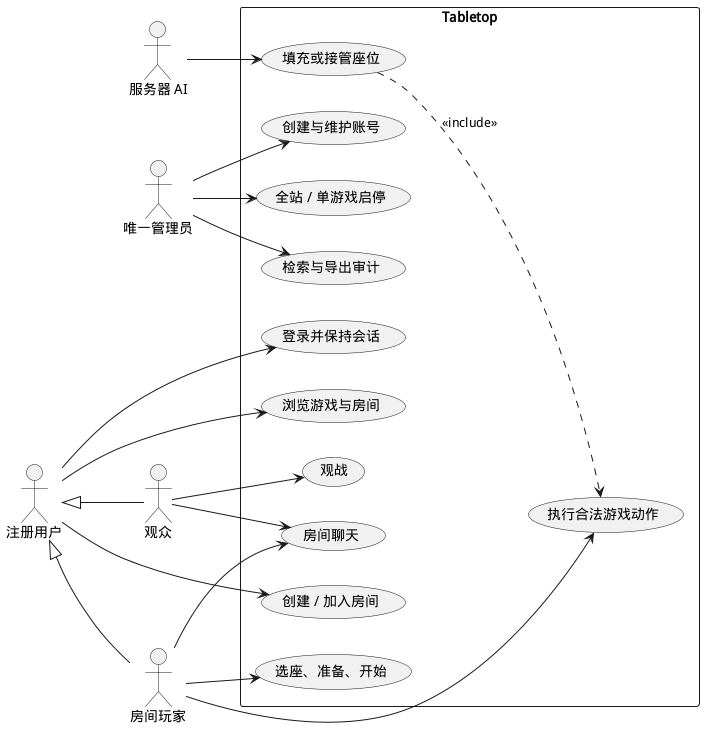

# Tabletop 需求规格说明

> 状态：已确认的实现与验收基线
> 版本：0.3
> 更新日期：2026-07-16
> 目标分支：`develop`

## 1. 文档目的

本文把需求访谈结论转换为可设计、可实现、可验收的平台级产品要求。读者包括项目维护者、游戏插件开发者和后续测试人员。本文只规定账号、目录、房间、连接、聊天、管理和插件扩展等公共能力，不规定任何具体游戏的玩家数、规则、动作、计时结局、AI 策略或胜负条件；这些内容由 `docs/games/` 下的独立游戏文档负责。

## 2. 产品背景与目标

Tabletop 面向少量熟人朋友，主要目标是让用户通过浏览器正常登录、创建或加入房间并完成实时联机对局，同时作为一个可以长期更新和接入新游戏的练手项目。

首期成功标准不是并发规模或商业指标，而是以下闭环稳定可用：

1. 管理员创建账号并启用网站和游戏。
2. 用户登录后从首页进入任一已启用的游戏插件。
3. 用户创建房间，通过房间列表或邀请链接邀请朋友。
4. 玩家选座、准备、开始并完成一局全自动规则对局。
5. 平台按稳定协议处理断线、重连、观战、聊天和再来一局，并把游戏相关事件交给插件裁决。

### 2.1 产品目标

| 编号 | 目标 | 验收含义 |
| --- | --- | --- |
| G-01 | 全自动规则 | 服务端拒绝非法操作并自动推进流程、计时和胜负结算 |
| G-02 | 可持续扩展 | 新游戏通过版本化代码插件接入，不修改账号、房间和网络核心 |
| G-03 | 实时联机 | 少量玩家优先通过 WebSocket 获得一致、低延迟的权威局面，并能在 WebSocket 受限时自动降级到 HTTP 长轮询 |
| G-04 | 单人练习 | 游戏可以用服务器 AI 填充空座，或声明由单个真人独立练习，无需实现离线网页 |
| G-05 | 长期可维护 | 规则、协议、数据和部署均有独立文档，稳定内容进入 `master` |

### 2.2 首期不做

- 不开放用户注册、第三方插件上传或在线脚本执行。
- 不实现手机端、PWA、离线游戏、语音、视频、私聊和文件消息。
- 不保存历史战绩、对局录像、跨天对局或聊天归档。
- 不实现匹配分、排行榜、赛季、付费、好友、公会和陌生人社交。
- 不实现管理员房间监控、房间详情查看或房间状态控制。
- 平台不统一规定具体游戏的规则变体、操作类型、AI 难度、超时后果或退出结局。
- 具体游戏的首期范围和明确不做项不在本文维护，避免平台需求与游戏规则出现双重真相。

## 3. 用户角色与用例

系统包含唯一管理员、普通注册用户、房间玩家、观众和 AI 五类角色。普通用户可以在不同房间中分别担任玩家或观众；AI 只占据游戏座位，不拥有账号和登录会话。

下图给出角色与首期用例的关系。管理员的服务权限仅包括全站和单游戏启停，不延伸到具体房间。

从图中可以看出，房间玩法由普通用户驱动，管理员只负责准入和服务可用性。游戏插件承担规则操作与可选 AI，平台核心把游戏动作视为不透明载荷，不解释其业务含义。

## 4. 功能需求

### 4.1 账号与登录

| 编号 | 要求 |
| --- | --- |
| AUTH-01 | 除登录页和必要静态资源外，首页、游戏、房间和管理页面均要求有效登录会话 |
| AUTH-02 | 系统不提供公开注册；唯一管理员在后台创建普通账号并设置初始密码 |
| AUTH-03 | 用户名长度为 3～32 个字符，可使用中文、英文字母、数字、下划线和短横线；英文字母不区分大小写且必须唯一 |
| AUTH-04 | 密码至少 6 个字符，使用 Argon2id 哈希保存，任何页面和日志都不得显示原密码 |
| AUTH-05 | 普通用户和管理员均可修改自己的密码；管理员可以重置普通用户密码 |
| AUTH-06 | 重置或修改密码后，目标账号的其他全部会话立即失效；当前修改密码的会话可重新签发 |
| AUTH-07 | 登录会话有效期为 30 天，活跃时续期；用户关闭浏览器后仍保持登录 |
| AUTH-08 | 同一账号允许多设备登录，并允许不同设备进入不同房间 |
| AUTH-09 | 同一登录设备只能控制一个房间；该账号的其他设备不能操作同一个房间，但可以进入观战位 |
| AUTH-10 | 账号只有离线且不属于任何房间时才能删除；禁用账号会立即撤销其全部会话并移出房间 |

未登录用户访问邀请链接时，系统先跳转登录，登录成功后恢复原邀请目标。登录、修改密码和后台写操作均受频率限制与审计约束。

### 4.2 首页、游戏目录与服务开关

| 编号 | 要求 |
| --- | --- |
| SITE-01 | 登录后首页展示已注册游戏、可用状态、创建入口和公开房间列表 |
| SITE-02 | 全站和每个游戏均有独立启停状态，并持久化到 SQLite |
| SITE-03 | 首次部署默认全站开启，所有编译注册的游戏默认开启 |
| SITE-04 | 单游戏关闭时立即终止该游戏的全部房间，用户收到原因后返回首页 |
| SITE-05 | 全站关闭时立即终止全部游戏房间；普通用户只看到维护提示，管理员仍可进入后台恢复服务 |
| SITE-06 | 重新开启服务不会恢复被终止的房间或对局 |

游戏关闭仅影响运行时可用性，不卸载插件、不删除配置，也不改变其他游戏。首页对关闭游戏显示不可进入状态，而不是从目录中完全隐藏。

### 4.3 房间大厅

| 编号 | 要求 |
| --- | --- |
| ROOM-01 | 用户按游戏创建房间，房间名默认是“用户名的游戏名房间”，可修改且最长 30 个 Unicode 字符 |
| ROOM-02 | 普通联机房都出现在公开列表；首期不提供用户可选的隐藏房间或仅邀请可见性，单机练习房按 `ROOM-16` 的固定例外隐藏 |
| ROOM-03 | 房间可设置密码；从列表进入时校验密码，通过不可猜测的邀请链接进入时绕过密码 |
| ROOM-04 | 邀请令牌创建后不提供轮换或撤销功能，房间销毁时自动失效 |
| ROOM-05 | 房间列表显示游戏、房间名、房主、玩家数、观众数、对局状态和密码标记 |
| ROOM-06 | 用户进入后默认是观众，再主动占据空座；游戏开始后默认只能进入观战位 |
| ROOM-07 | 游戏插件声明是否允许中途加入；平台只按声明开放入口，不统一规定具体游戏的选择 |
| ROOM-08 | 玩家自行选择空座，房主不能强制调整其他玩家座位 |
| ROOM-09 | 开局前玩家需要准备；房主修改游戏设置后清除全部准备状态 |
| ROOM-10 | 房主可以转移房主、修改未开局设置、添加或移除 AI、踢出未开局玩家和观众 |
| ROOM-11 | 对局中房主只能踢出观众，不能踢出在局玩家 |
| ROOM-12 | 房主主动退出时自动转移给最早进入的剩余真人成员；房主断线窗口到期时优先转移给最早进入且仍在线的真人成员，没有在线候选时暂时保留原房主身份，并在之后有成员连接时再次转移 |
| ROOM-13 | 每个房间最多 10 名观众；观众可以查看公开视图和参与房间聊天 |
| ROOM-14 | 对局结束后保留房间、座位和聊天，玩家重新准备后可以再来一局 |
| ROOM-15 | 最后一名真人离开后立即销毁房间、AI 和聊天记录 |
| ROOM-16 | 单机练习房固定不出现在公开房间列表，只能由创建者或通过邀请链接进入 |

单机练习房至少包含一名真人。声明 `bots` 能力的插件由创建者从公开的 `botProfiles` 中选择练习 AI，平台用该 AI 填充其余座位；声明 `soloPractice` 能力的无 AI 插件保留其余座位为空，并允许一个已准备真人开始练习，受邀成员只能观战而不能占用空座。普通联机房仍遵守 manifest 的 `minPlayers`，单人放宽只适用于同时标记为练习房且由插件明确声明支持的房间。平台在创建前调用插件开局校验，设置或座位组合不兼容时拒绝创建。练习房不出现在公开列表中，只能由创建者或邀请链接进入。

### 4.4 实时连接与断线

| 编号 | 要求 |
| --- | --- |
| NET-01 | 对局状态由服务端唯一权威维护；客户端只提交意图，不直接决定动作结果 |
| NET-02 | 每次实际状态变化递增房间修订号；合法 `noop` 保持修订号并以 `stateChanged: false` 确认，客户端按修订号检测重复、乱序和过期操作 |
| NET-03 | 平台支持插件在房间连接断开后启用临时自动控制器；是否启用以及临时控制器执行什么动作由游戏插件声明 |
| NET-04 | 服务端为原登录会话保留 30 秒重连窗口；窗口内重连后发送当前完整投影快照并取消对应截止任务 |
| NET-05 | 服务器重启会终止全部房间和对局，不要求从 SQLite 恢复 |
| NET-06 | 主动退出、连接恢复和重连窗口到期均作为系统事件提交给游戏插件；比赛结局、控制器变化和座位是否可再次取回由插件返回的策略结果决定 |
| NET-07 | 平台不得在公共房间或网络模块中根据 `gameId` 分支处理断线结果，也不得回滚临时控制器已经被插件接受的动作 |
| NET-08 | 每个成功命令返回带 `stateChanged` 的 `command.ack`；状态变化另外广播按接收者投影的完整快照 |
| NET-09 | 重连窗口到期后清除无座离线观众并释放会话房间绑定；仍有关联座位的成员可按插件策略保留，原会话再次加入同一房间时复用原成员身份 |
| NET-10 | 首次 join 在传输中断导致结果不明确时，已预绑定但从未连接的原会话可以用 `room.resume` 完成首次 attach，不向插件伪造恢复事件 |
| NET-11 | 房间连接优先使用 WebSocket；构造、握手或首个快照超时后自动使用同源 HTTP 长轮询，并共享会话鉴权、命令 schema、限流、去重、房间绑定和快照语义 |

30 秒窗口是平台连接机制，不是游戏规则。窗口内自动恢复要求原账号和原登录会话匹配；窗口到期后平台释放连接恢复凭据，再执行插件返回的通用房间指令。无座观众清理、同会话成员复用和离线房主转移属于平台成员生命周期；比赛结果、临时接管和后续取回仍由每款游戏在自己的设计文档中定义。

### 4.5 房间聊天

| 编号 | 要求 |
| --- | --- |
| CHAT-01 | 只提供当前房间的纯文本聊天，不支持 Markdown、图片、文件或链接预览 |
| CHAT-02 | 单条消息最长 500 个字符；每个会话每 5 秒最多发送 10 条 |
| CHAT-03 | 每房只在内存保留最近 100 条消息，超出后按先进先出删除最早消息 |
| CHAT-04 | 重连时返回当前内存窗口内的聊天记录；房间销毁或服务重启后记录消失 |
| CHAT-05 | 服务端对消息做长度、频率和控制字符校验；客户端按纯文本渲染以防注入 |

### 4.6 管理后台

| 编号 | 要求 |
| --- | --- |
| ADMIN-01 | 系统只有一个管理员账号，初始管理员通过部署命令或环境初始化 |
| ADMIN-02 | 管理员可以创建、禁用和删除普通账号，设置或重置密码，并修改自己的密码 |
| ADMIN-03 | 管理员可以启停全站和单个游戏；不查看或管理房间列表、房间详情和对局状态 |
| ADMIN-04 | 后台记录登录失败、账号管理、密码重置、服务启停和管理员密码修改 |
| ADMIN-05 | 审计日志保留 30 天，可按时间、账号和操作类型检索并导出 CSV |
| ADMIN-06 | 唯一管理员不能禁用或删除自己 |

### 4.7 游戏插件与 AI

| 编号 | 要求 |
| --- | --- |
| GAME-01 | 游戏由核心开发者编写代码插件并随仓库一起构建，不允许运行时上传 |
| GAME-02 | 插件分别提供共享类型、服务端规则、浏览器界面和可选 AI，不是独立网站或独立应用 |
| GAME-03 | 插件声明玩家数、交互模式、观战、中途加入、计时、隐藏信息、AI 和连接事件策略等能力 |
| GAME-04 | 插件声明可验证的设置结构，并可提供自定义设置界面 |
| GAME-05 | 插件负责初始化、动作校验、状态迁移、系统事件处理、玩家视图投影、结束判定和再开一局规则 |
| GAME-06 | 游戏 SDK 使用主版本号；同一主版本保持向后兼容，新增能力采用可选接口 |
| GAME-07 | 第一版只实现当前游戏需要的回合制能力，但接口为未来同时行动和实时 tick 保留扩展位 |
| GAME-08 | 仓库提供可复制但不注册上线的 `games/template`、完整扩展检查清单和官方插件参考实现 |
| GAME-09 | `GET /api/v1/games` 为每个插件返回公开 `botProfiles` 元数据；没有可配置 AI 时返回空数组，兜底控制器不进入该目录 |
| GAME-10 | 架构守卫只允许服务端和浏览器组合根导入具体游戏包，并禁止公共生产代码按具体 `gameId` 分支 |
| AI-01 | AI 在服务端执行，使用与真人相同的合法动作入口，不得直接修改游戏状态 |
| AI-02 | AI 不得读取其他玩家隐藏信息或未来随机数，只接收对应座位的投影视图和合法动作上下文 |
| AI-03 | AI 计算不得阻塞 Node.js 网络事件循环；生产默认使用全站单 Worker Thread 串行执行，并对每个任务设置硬超时 |
| AI-04 | 平台支持与房主可添加 AI 分离的断线/超时兜底控制器；插件可按自身规则声明是否提供以及如何降级 |

## 5. 平台与游戏文档边界

平台文档与游戏文档按下表划分所有权。一个行为只能有一处权威定义，其他文档可以链接但不能复制规则。

| 平台文档负责 | `docs/games/<game-id>.md` 负责 |
| --- | --- |
| 账号、会话、设备与权限 | 具体参与人数、座位和阵营语义 |
| 游戏注册、目录、房间和观战基础设施 | 设置项、规则变体和开局流程 |
| 房间传输、修订号、快照和 30 秒重连机制 | 合法动作、状态迁移、随机与计时规则 |
| 系统事件名称、调用时机和通用指令格式 | 断线、主动退出、超时和重连到期的比赛结果 |
| AI/兜底控制器运行与资源隔离能力 | AI profile、决策策略、思考预算和失败降级 |
| 插件版本、投影安全和兼容合同 | 胜负、排名、和局、再开一局及规则测试基准 |

平台实现不得根据具体 `gameId` 硬编码上述右栏行为。新增或修改游戏规则时，先更新对应游戏文档，再同步实现与测试。

当前游戏规则的权威说明仅见 [五子棋设计文档](games/gomoku.md) 和 [飞行棋设计文档](games/ludo.md)。这些链接用于定位所有权，平台文档不复制其中任何具体规则。

## 6. 非功能需求

### 6.1 兼容性与体验

- 支持桌面版 Chromium 内核的 Chrome 和 Edge。
- 设计基准为 1920x1080，最低可用窗口为 1280x720。
- 不要求移动端布局；浏览器窗口缩放时不能出现关键控件遮挡或文本溢出。
- 不提供音效；游戏动画应简短，并且动画不能改变服务端动作生效时间。
- 中文是唯一界面语言，插件 API 不强制国际化。
- 游戏视觉和界面素材使用项目原创或明确授权的资源，不直接复制第三方网站或商业游戏素材。

### 6.2 正确性与性能

- 所有合法性、计时、随机数和胜负结果以服务端为准。
- 普通房间动作在目标服务器上的服务端处理目标为 P95 小于 100 毫秒，不含公网往返和 AI 思考时间。
- 可配置 AI profile 必须声明硬时间预算；当前 v1 兜底控制器使用平台 250 ms 预算。宿主在预算到期时终止 Worker 或忽略过期结果，具体 AI profile 预算由游戏文档定义。
- 单进程应轻松承载项目预期的少量房间和用户，不为假设的大规模并发引入 Redis、消息队列或集群一致性。
- 官方游戏至少覆盖规则边界、状态迁移、计时和断线接管的自动化测试。

### 6.3 安全与运维

- 会话 Cookie 使用 `HttpOnly` 和 `SameSite=Lax`；启用 HTTPS 后必须增加 `Secure`。数据库中的会话与 CSRF 摘要使用 `SESSION_SECRET` 参与的 HMAC，轮换密钥会使旧会话全部失效。
- 登录、房间创建与取票、聊天和管理员操作均执行服务端输入校验和频率限制；密码哈希有固定并发数和有界等待队列。
- SQLite 数据文件、配置和备份不进入 Git，运行进程使用专用低权限系统账号。
- 当前按用户要求允许通过公网 IP 的 HTTP 临时联调。该模式下密码传输未加密，不属于安全生产部署。
- SQLite 由 systemd timer 每日在线备份，完成完整性检查后保存，当前保留 30 天且仅存放在当前服务器。

## 7. 数据保存范围

| 数据 | 介质 | 生命周期 |
| --- | --- | --- |
| 账号、密码哈希 | SQLite | 账号删除前 |
| 登录会话 | SQLite | 30 天滑动过期或主动撤销 |
| 服务启停状态 | SQLite | 持久保存 |
| 管理审计 | SQLite | 30 天 |
| 房间、座位、游戏局面 | 进程内存 | 房间销毁或服务重启 |
| 房间聊天 | 每房 100 条内存队列 | 房间销毁或服务重启 |
| 战绩、录像、排行榜 | 不保存 | 不适用 |

## 8. 里程碑与验收

1. **平台设计基线**：需求、架构、插件、协议、数据和部署文档与实现同步，平台与游戏所有权边界明确。
2. **端到端骨架**：账号、首页、房间和服务端权威房间连接基础可运行。
3. **参考插件闭环**：至少一个官方插件完成登录、房间、联机、系统事件和结算的端到端验证。
4. **插件接口固化**：从参考实现中抽取 `Game SDK v1`，扩展指南与模板可用。
5. **扩展性验证**：接入具有不同参与人数、随机或阶段模型的附加插件，验证公共层没有具体规则分支。
6. **部署交付**：账号后台、启停、审计、备份、IP 访问和手动部署脚本可用。

每个里程碑先在 `develop` 完成实现和验证，确认后再进入 `master`。项目不使用 Pull Request 作为强制流程。

## 9. 需求冻结状态

本版平台需求已经完成访谈收口，没有阻塞总体架构和工程骨架的开放产品问题。具体游戏出现规则边界或行为选择时，只更新 `docs/games/` 下的权威游戏文档，不把其结论反向复制到平台需求中。
